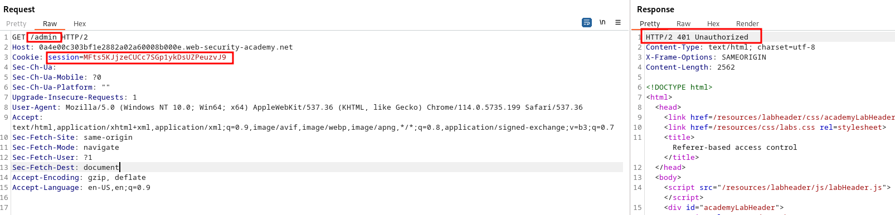

# Lab description
The idea of this lab is to use the `Referer` header to bypass an administrative access control. For that, we need to see where the `Referer` header is being used, and then, create a request as Wiener with this header to bypass the access control.

# Writeup
Note that we are given Admin credentials to see the requests performed and check where the `Referer` header is being used as an access control mechanism. For that, let's log in as administrator and take a look.

We have an admin panel, in which we can upgrade the user, as always: 

Let's upgrade carlos and check the HTTP requests that happen. 
Hmmm, when performing the operation to upgrade the user privileges, there is a `Referer` header existing:

Let's use the user Wiener and visit the /admin endpoint, to see if we can:

Sad, we are not authorized to view the /admin endpoint as Wiener. And what if we try to go to the endpoint to upgrade the user?

We are unauthorized, too. But, we know this endpoint used the `Referer` header to indicate that we came from /admin. Adding this header leads us to a bypass of the verification, as the server **thinks we are already logged in, as we come from /admin (that is what the header is indicating)**.

We upgraded our privileges, ending the lab.

