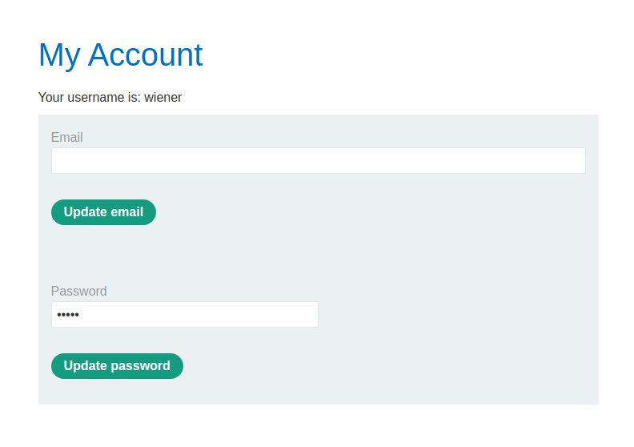
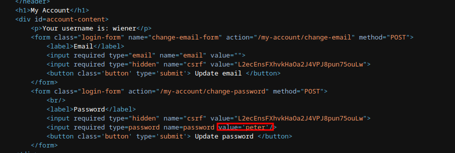
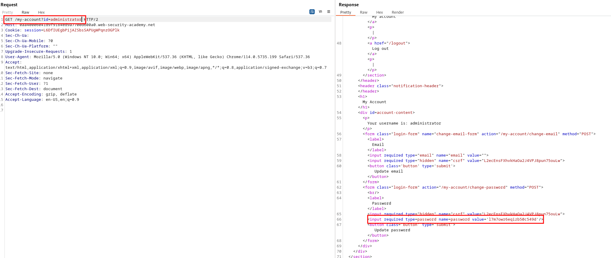
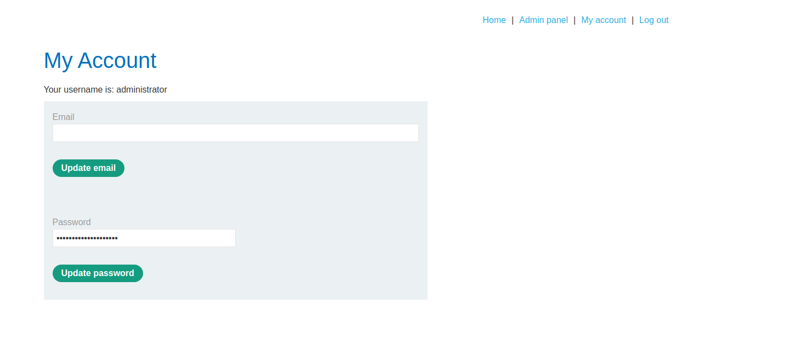
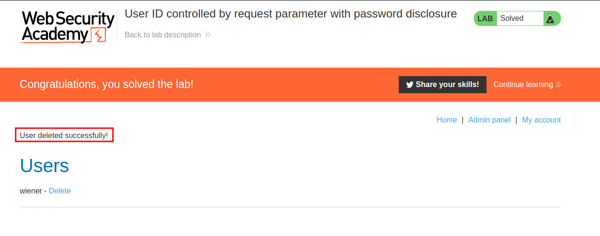

# Lab description
This lab has user account page that contains the current user's existing password, prefilled in a masked input. To solve the lab, retrieve the administrator's password, then use it to delete the user `carlos`.

# Writeup
The idea is to try to perform an horizontal privesc targeting the administrator user, retrieve the password and use it to log in as him and perform administrative operations with the user. We can see that **at first we used an horizontal privesc technique which turned into a vertical privesc technique.**

Let's log in as wiener:peter and accessing to our profile:

We can see that our password is there, reading the source code displays it:

We can try to get the admin profile, let's see if we can get the admin password using horizontal privesc by changing the ID in the URL, as in this lab: [horizontal_privesc_user_id_in_request](horizontal_privesc_user_id_in_request.md).

We get the admin password, we can use it to log in as the admin and delete carlos:

We first used horizontal privesc to finally escalate privileges.

