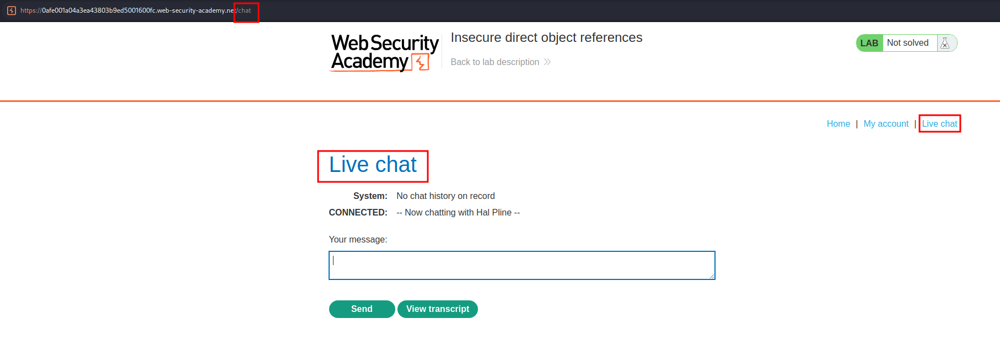
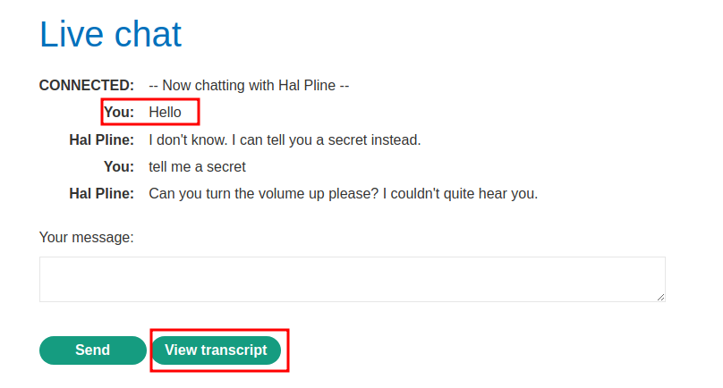
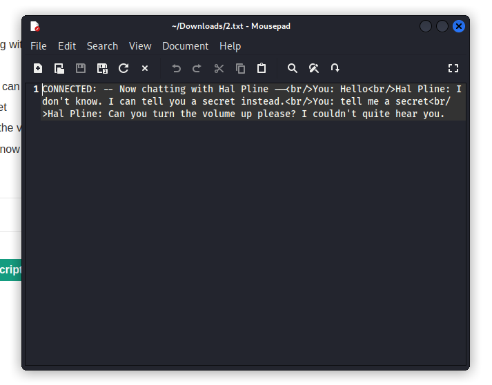
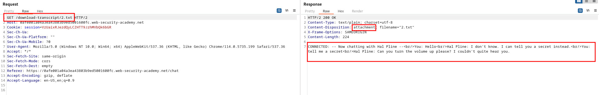
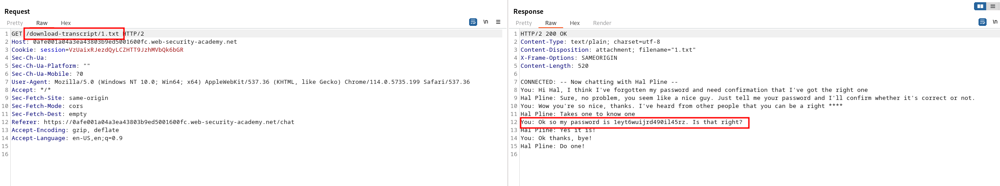
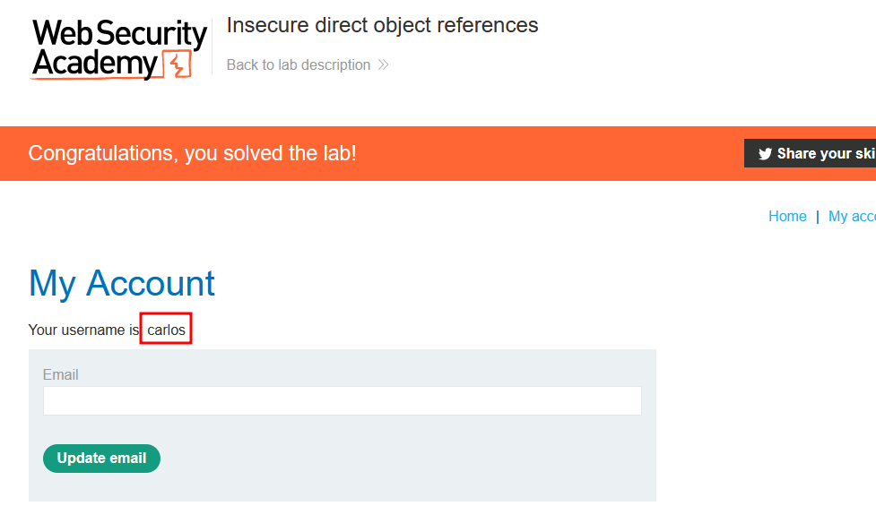

# Lab description
This lab stores user chat logs directly on the server's file system, and retrieves them using static URLs. Solve the lab by finding the password for the user `carlos`, and logging into their account.

# Writeup
Let's access the server. We have a new section that is called "Live chat", which allows us to send chat messages to somebody: 

We can send messages, and then view the transcript. Here I am sending messages:

And when clicking the link to view the transcript, I get a downloaded TXT file with the transcript info:

Let's see the underlying request that happens when we click on "View transcript":

OK, so we are performing a GET request to /download/transcript with the **direct reference to the object 2.txt, which means that probably, there will be a file called 1.txt. Let's try to get that object:**

And we can see that the object reference is insecure, we can access this object without being the user that performed this conversation and get the password.
Using this password to log in as carlos completes the lab.

