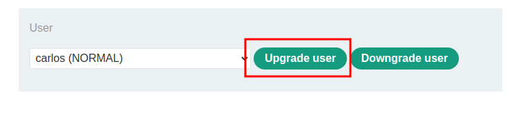
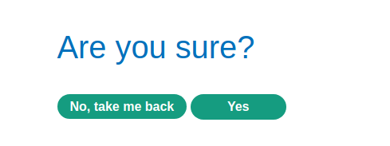
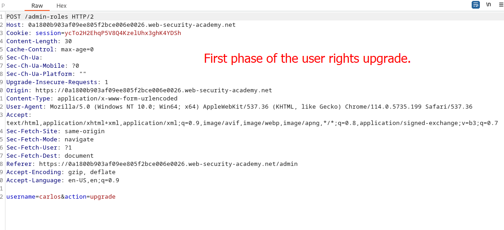
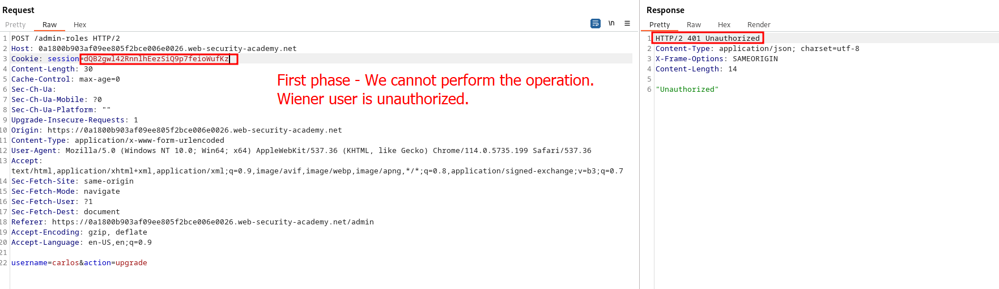
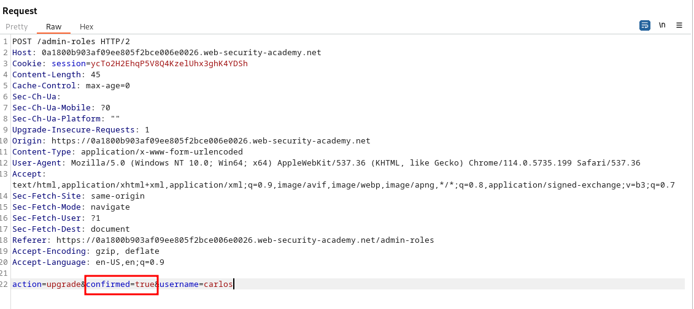
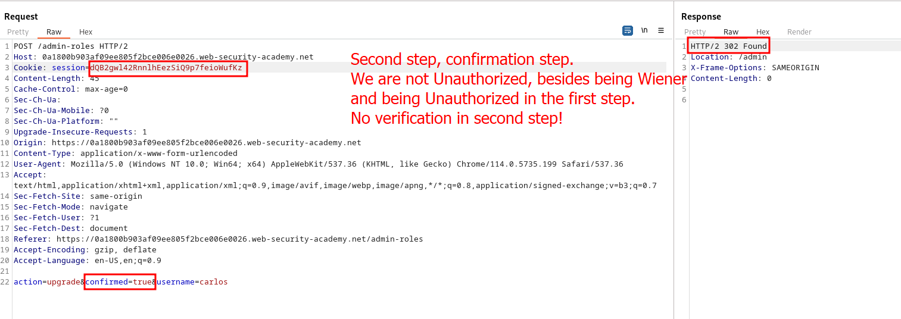
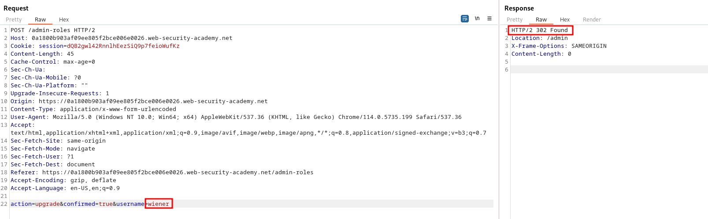
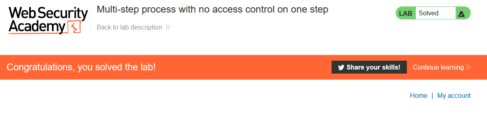

# Lab description
This lab covers vulnerabilities in multi-step process. An attacker could try to bypass some of the phases, usually the first ones, of a multi-step process. If the last phases are not applying the same security, the game is over.

# Writeup
It is important to know the lab description: 
> This lab has an admin panel with a flawed multi-step process for changing a user's role. You can familiarize yourself with the admin panel by logging in using the credentials `administrator:admin`.
> To solve the lab, log in using the credentials `wiener:peter` and exploit the flawed [access controls](https://portswigger.net/web-security/access-control) to promote yourself to become an administrator.

The hint that we have is that **there is one step which is not performing verification. We have to find it.**

Let's log in first as admin and take a look.
When logging in as admin, we can see that there is as function to update the user privileges:

If we click on "Upgrade user", a **multi-step verification happens, asking for confirmation to perform this action:**

What we can think now is that, the first request to "Upgrade user" is protected, but the second one, when you decide to go back or confirm the action, is not protected. Let's confirm it by taking these two requests (the first step and the second step) and performing these actions with wiener user:
**This is the first phase of the user rights upgrade**

By sending this request with the wiener session cookie, we cannot do the operation:

But, let's see the second, confirmation request. Will the server verify if we have done the first request being authorized? Will it skip it and just validate the second step? And, what is more important... Will the second step implement validation? Let's see it. This is the second step:

Just adding a "confirmed" parameter to the same endpoint, so let's send this request with wiener user cookie and verify if the server responds "Unauthorized" too, as it should: 

Just update our privileges and end the lab!

