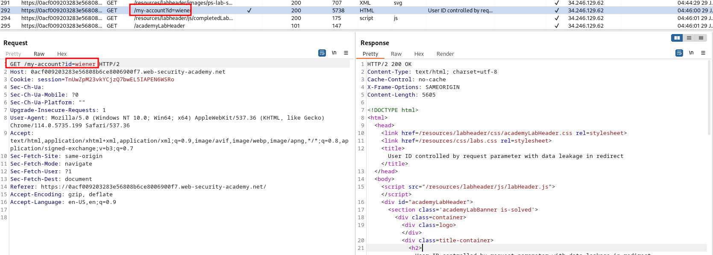
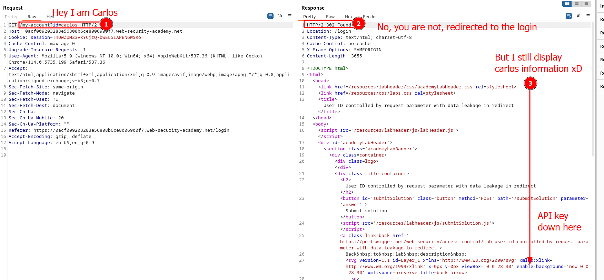
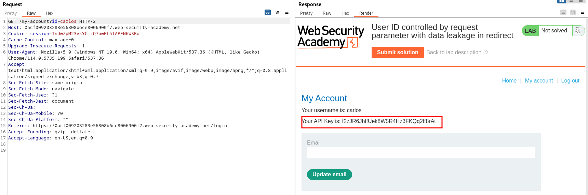
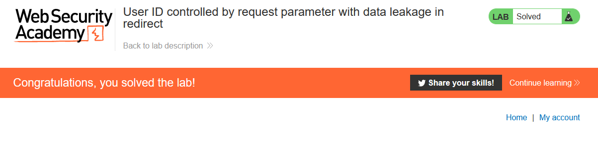

# Lab description
This lab is the continuation of [horizontal_privesc_unpredictable_user_id_in_request](horizontal_privesc_unpredictable_user_id_in_request.md)erver performs a redirect, indicating that we do not have the rights required, but **performs a leakage in the redirect body. Inspecting this body and crafting another attack leads us to a privilege escalation.**

# Writeup

This is very fast and easy to explain. 
Visiting the page and login in with wiener:peter, we see the typical request to my account:

The thing is that we do not have any information, so we just take that request and change the username to "carlos". When sending the request, **the page sends a redirect to the login page, but it still leaks the API key (remember that redirects should be empty as it is going to be redirected, and not show information in most of the cases).** Here is the 302 redirect with leak:

Rendering this page shows that, indeed, the carlos panel is there:

Submitting the API key as the reward.
