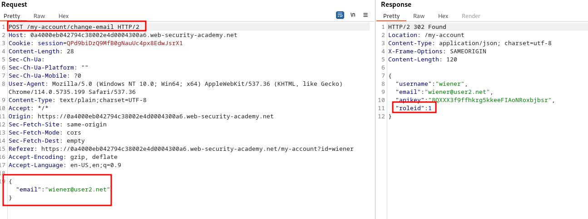
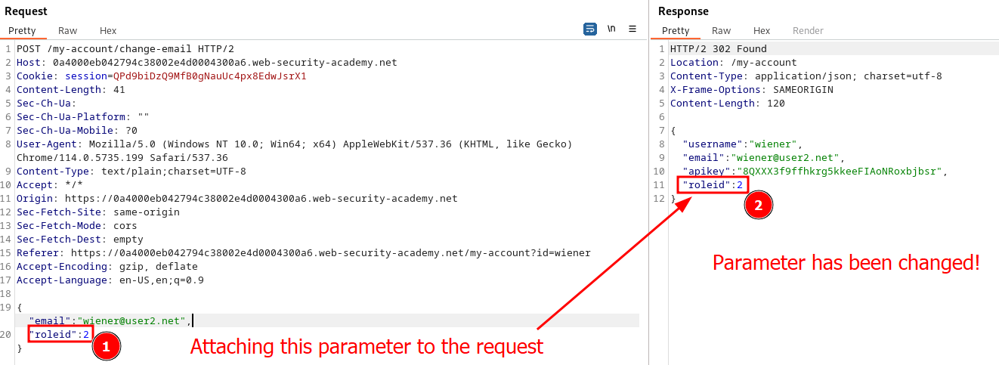
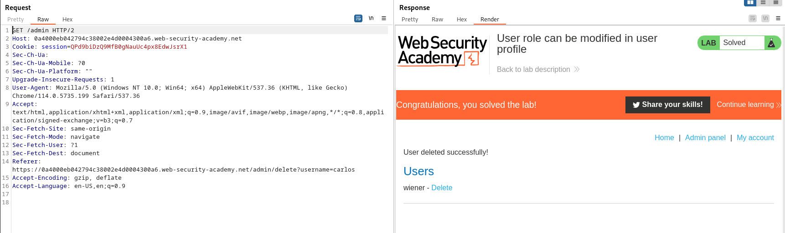

# Lab description
Imagine a page with the best access controls possible, they can't be break.
But the endpoint to change the user role is bypasseable and you can change your role or rights.
You literally have bypassed all the access controls possible.
This lab consists in doing that, changing the user rights in the user profile to bypass the rest of access controls.

> This lab has an admin panel at `/admin`. It's only accessible to logged-in users with a `roleid` of 2.

The idea is to get roleid to 2 and then access /admin.

# Writeup
Let's login as wiener:peter. I don't see any new endpoint, and I try to perform an email change:

Ok, we have roleid to 1, that is not what we want. I thought... What if I add the "roleid" parameter with the specified number I want to change? Will it update it? And the answer is YES. I updated the dictionary to include my desired roleid, and the server changed it. Now we are admins:

Now, visit the admin panel and delete the user "carlos"!

