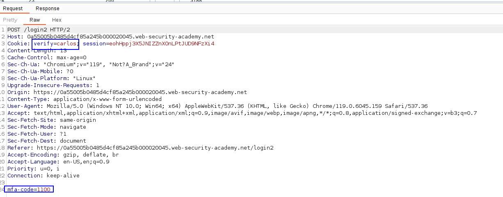
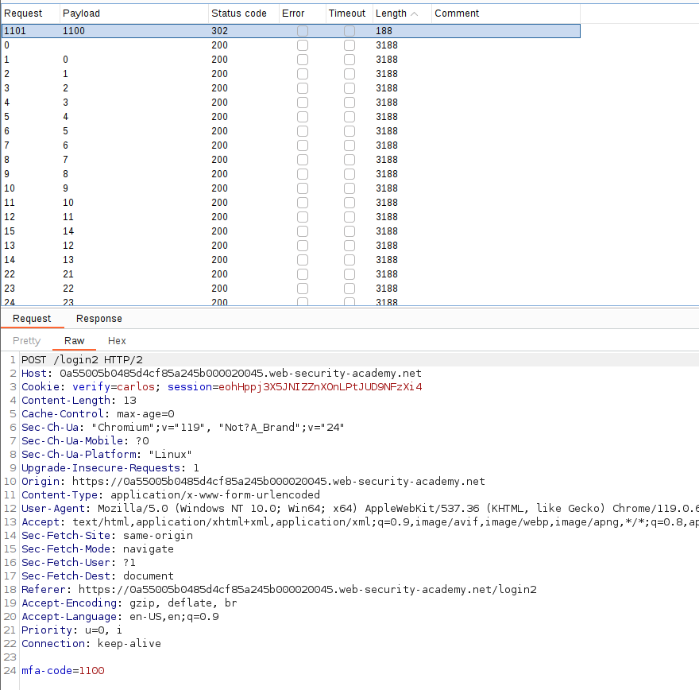
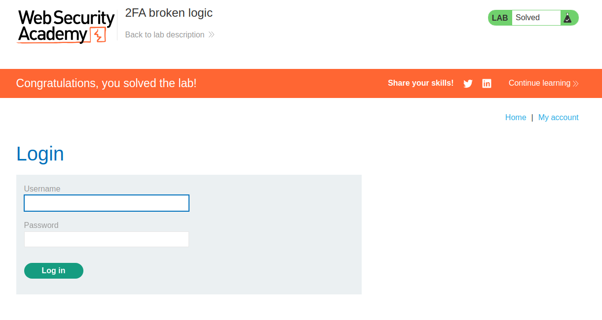

When performing the second verification step, the client sends a cookie indicating the user that is being logged in:

As this cookie is the one that the server is using to authenticate the user on a valid code, what we can do is to create a login attempt with our user and replace the username with the username that we want to compromise.
Then, we just bruteforce the mfa code, until we get the correct one:

The response to this request includes a session cookie of the logged-in user that we can attach in the requests to be logged as the victim. Remember to attach that cookie to the requests.
