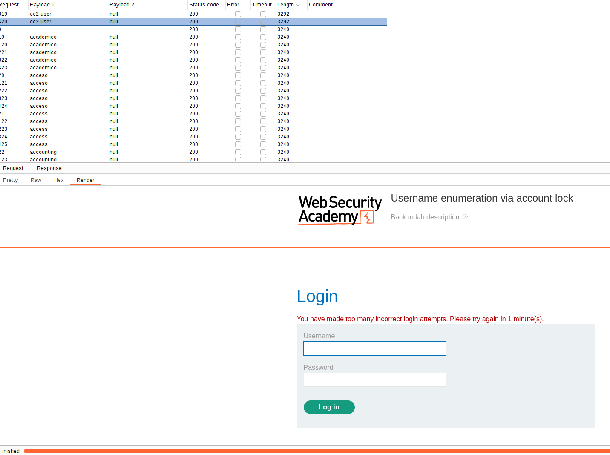

# What is authentication?
Authentication is the process of **verifying the identity of a user or client**. 
Websites are potentially exposed to anyone who is connected to the internet. 
Therefore, authentication mechanisms are pretty important for the security of a website.

There are three main types of authentication:
- Something you **know**, such as a **password** or the answer to a security question. These are sometimes called "knowledge factors".
- Something you **have**, This is a **physical object such as a mobile phone or security token**. These are sometimes called "possession factors".
- Something you **are** or **do**. For example, your biometrics or patterns of behavior. These are sometimes called "inherence factors".

## What is the difference between authentication and authorization?
**Authentication** is the process of verifying that a user is who they claim to be. This can be translated as: Are you who you claim to be?
**Authorization** involves verifying whether a user is allowed to do something. This translates as: Do you have the rights to do what you are asking to do?

For example, authentication determines whether someone attempting to access a website with the username `Carlos123` really is the same person who created the account.
Once `Carlos123` is authenticated, their permissions determine what they are authorized to do. For example, they may be authorized to access personal information about other users, or perform actions such as deleting another user's account.

# How do authentication vulnerabilities arise?
Most vulnerabilities in authentication mechanisms occur in one of two ways:
- The authentication mechanisms are **weak** because they fail to adequately protect **against brute-force attacks.** Brute-force attacks are one of the main threats for authentication.
- **Logic flaws** or poor coding in the implementation allow the authentication mechanisms to be bypassed entirely by an attacker. This is sometimes called "broken authentication". 

Broken authentication, next to brute-force attacks, are the two most important attacks against authentication.

In many areas of web development, [logic flaws](https://portswigger.net/web-security/logic-flaws) cause the website to behave unexpectedly, which may or may not be a security issue. However, as authentication is so critical to security, it's very likely that flawed authentication logic exposes the website to security issues.

# What is the impact of vulnerable authentication?
The impact of authentication vulnerabilities can be **severe**. If an attacker bypasses authentication or brute-forces their way into another user's account, **they have access to all the data and functionality that the compromised account has.** If they are able to compromise a high-privileged account, such as a system administrator, they could take full control over the entire application and potentially gain access to internal infrastructure.
As we can see, we can scale horizontal or vertically.

Even compromising a low-privileged account might still grant an attacker access to data that they otherwise shouldn't have, such as commercially sensitive business information. Even if the account does not have access to any sensitive data, **it might still allow the attacker to access additional pages, which provide a further attack surface**. Often, high-severity attacks are not possible from publicly accessible pages, but they may be possible from an internal page.

# Vulnerabilities in password-based login
For websites that adopt a password-based login process, users either register for an account themselves or they are assigned an account by an administrator. This account is associated with a unique username and a secret password, which the user enters in a login form to authenticate themselves.

## Brute-force attacks
Brute force attacks is the usage of a system of **trial and error to guess valid user credentials.**
Those attacks are commonly automated, using wordlists of usernames and passwords.
Automating this process enables an attacker to make vast number of login attempts at high speed.

By also using basic logic or publicly available knowledge, attackers can fine-tune brute-force attacks to make much more educated guesses. This considerably increases the efficiency of such attacks. Websites that rely on password-based login as their sole method of authenticating users can be highly vulnerable if they do not implement sufficient brute-force protection.

### Brute-forcing usernames
Usernames are especially easy to guess if they conform to a recognizable pattern, such as an email address. For example, it is very common to see business logins in the format `firstname.lastname@somecompany.com`. However, even if there is no obvious pattern, sometimes even high-privileged accounts are created using predictable usernames, such as `admin` or `administrator`.

During auditing, check whether the website discloses potential usernames publicly. For example, are you able to access user profiles without logging in? Even if the actual content of the profiles is hidden, the name used in the profile is sometimes the same as the login username. You should also check HTTP responses to see if any email addresses are disclosed. Occasionally, responses contain email addresses of high-privileged users, such as administrators or IT support.

### Brute-forcing passwords
Passwords can similarly be brute-forced, with the difficulty varying based on the strength of the password. Many websites adopt some form of password policy, which forces users to create high-entropy passwords that are, theoretically at least, harder to crack using brute-force alone. This typically involves enforcing passwords with:

- A minimum number of characters
- A mixture of lower and uppercase letters
- At least one special character

However, while high-entropy passwords are difficult for computers alone to crack, we can use a basic knowledge of human behavior to exploit the vulnerabilities that users unwittingly introduce to this system. Rather than creating a strong password with a random combination of characters, users often take a password that they can remember and try to crowbar it into fitting the password policy. For example, if `mypassword` is not allowed, users may try something like `Mypassword1!` or `Myp4$$w0rd` instead.

In cases where the policy requires users to change their passwords on a regular basis, it is also common for users to just make minor, predictable changes to their preferred password. For example, `Mypassword1!` becomes `Mypassword1?` or `Mypassword2!.`

This knowledge of likely credentials and predictable patterns means that brute-force attacks can often be much more sophisticated, and therefore effective, than simply iterating through every possible combination of characters.

### Username enumeration
Username enumeration is when an attacker is able to observe changes in the website's behavior in order to identify whether a given username is valid.

Username enumeration typically occurs either on the login page, for example, when you enter a valid username but an incorrect password, or on registration forms when you enter a username that is already taken. This greatly reduces the time and effort required to brute-force a login because the attacker is able to quickly generate a shortlist of valid usernames.

While attempting to brute-force a login page, you should pay particular attention to any differences in:
- **Status codes**: During a brute-force attack, the returned HTTP status code is likely to be the same for the vast majority of guesses because most of them will be wrong. If a guess returns a different status code, this is a strong indication that the username was correct. It is best practice for websites to always return the same status code regardless of the outcome, but this practice is not always followed.
- **Error messages**: Sometimes the returned error message is different depending on whether both the username AND password are incorrect or only the password was incorrect. It is best practice for websites to use identical, generic messages in both cases, but small typing errors sometimes creep in. Just one character out of place makes the two messages distinct, even in cases where the character is not visible on the rendered page.
- **Response times**: If most of the requests were handled with a similar response time, any that deviate from this suggest that something different was happening behind the scenes. This is another indication that the guessed username might be correct. For example, a website might only check whether the password is correct if the username is valid. This extra step might cause a slight increase in the response time. This may be subtle, but an attacker can make this delay more obvious by entering an excessively long password that the website takes noticeably longer to handle.

Here is a lab that covers username enumeration and bruteforcing of the password: [username_enumeration_via_different_responses](labs/username_enumeration_via_different_responses.md)

Here is a lab that covers a bit more advanced technique: [username_enumeration_subtle_different_responses](labs/username_enumeration_subtle_different_responses.md)

And here is the last lab of that topic that covers time-based username enumeration: [username_enumeration_based_on_timing](labs/username_enumeration_based_on_timing.md)

### Flawed brute-force protection
It is highly likely that a brute-force attack will involve many failed guesses before the attacker successfully compromises an account. Logically, brute-force protection revolves around trying to make it as tricky as possible to automate the process and slow down the rate at which an attacker can attempt logins. The two most common ways of preventing brute-force attacks are:
- Locking the account that the remote user is trying to access if they make too many failed login attempts
- Blocking the remote user's IP address if they make too many login attempts in quick succession

Both approaches offer varying degrees of protection, but neither is invulnerable, especially if implemented using flawed logic.

For example, you might sometimes find that your IP is blocked if you fail to log in too many times. In some implementations, the counter for the number of failed attempts resets if the IP owner logs in successfully. This means an attacker would simply have to log in to their own account every few attempts to prevent this limit from ever being reached.

**In this case, merely including your own login credentials at regular intervals throughout the wordlist is enough to render this defense virtually useless.** Therefore, if you get blocked, try to spoof the IP and also try to log in correctly to see if the mechanism gets reset.

Here is a lab that covers this topic: [ip_block_bypass_correct_login](labs/ip_block_bypass_correct_login.md)
#### Account locking
One way in which websites try to prevent brute-forcing is to lock the account if certain suspicious criteria are met, **usually a set number of failed login attempts.** Instead of blocking the IP address from where the requests are performed, the whole account is locked to avoid spoofing mechanisms
Just as with normal login errors, responses from the server indicating that an account is locked can also help an attacker to enumerate usernames. If the account get's blocked, that means that there is an account.

For example, in the following image, we can see that we discovered an user because the message displayed was telling us that the user was blocked:

# HTTP basic authentication
Although fairly old, its relative simplicity and ease of implementation means you might sometimes see HTTP basic authentication being used. In HTTP basic authentication, the client receives an authentication token from the server, which is constructed by concatenating the username and password, and encoding it in Base64. This token is stored and managed by the browser, which automatically adds it to the `Authorization` header of every subsequent request as follows:
`Authorization: Basic base64(username:password)`

For a number of reasons, **this is generally not considered a secure authentication method.** Firstly, it involves repeatedly sending the user's login credentials with every request. Unless the website also implements HSTS, user credentials are open to being captured in a man-in-the-middle attack.

In addition, implementations of HTTP basic authentication often don't support brute-force protection. **As the token consists exclusively of static values, this can leave it vulnerable to being brute-forced.**

HTTP basic authentication is also particularly vulnerable to session-related exploits, notably [CSRF](https://portswigger.net/web-security/csrf), against which it offers no protection on its own.

In some cases, exploiting vulnerable HTTP basic authentication might only grant an attacker access to a seemingly uninteresting page. However, in addition to providing a further attack surface, the credentials exposed in this way might be reused in other, more confidential contexts.
## Bypassing two-factor authentication
At times, the implementation of two-factor authentication is flawed to the point where it can be bypassed entirely.

If the user is first prompted to enter a password, and then prompted to enter a verification code on a separate page, the user is effectively in a "logged in" state before they have entered the verification code. In this case, it is worth testing to see if you can directly skip to "logged-in only" pages after completing the first authentication step. Occasionally, you will find that a website doesn't actually check whether or not you completed the second step before loading the page.

Here is the lab that covers this scenario: [2fa_simple_bypass](labs/2fa_simple_bypass.md)

# Vulnerabilities in multi-factor authentication
We have seen vulnerabilities in websites that include a single-factor authentication method, such as **username-password** (credentials).

Verifying biometric factors is impractical for most websites. However, it is increasingly common to see both mandatory and optional two-factor authentication (2FA) based on **something you know** and **something you have**. This includes, for example, a token sent to the mobile, such as an SMS code.

While it is sometimes possible for an attacker to obtain a single knowledge-based factor, such as a password, being able to simultaneously obtain another factor from an out-of-band source is considerably less likely. For this reason, two-factor authentication is demonstrably more secure than single-factor authentication. However, as with any security measure, it is only ever as secure as its implementation. Poorly implemented two-factor authentication can be beaten, or even bypassed entirely, just as single-factor authentication can.

# Flawed two-factor verification logic
Sometimes flawed logic in two-factor authentication means that after a user has completed the initial login step, the website doesn't adequately verify that the same user is completing the second step.

For example, the user logs in with their normal credentials in the first step as follows:
`POST /login-steps/first HTTP/1.1 Host: vulnerable-website.com ... username=carlos&password=qwerty`

They are then assigned a cookie that relates to their account, before being taken to the second step of the login process:
`HTTP/1.1 200 OK Set-Cookie: account=carlos GET /login-steps/second HTTP/1.1 Cookie: account=carlos`

When submitting the verification code, the request uses this cookie to determine which account the user is trying to access:
`POST /login-steps/second HTTP/1.1 Host: vulnerable-website.com Cookie: account=carlos ... verification-code=123456`

In this case, an attacker could log in using their own credentials but then change the value of the `account` cookie to any arbitrary username when submitting the verification code.
`POST /login-steps/second HTTP/1.1 Host: vulnerable-website.com Cookie: account=victim-user ... verification-code=123456`

This is extremely dangerous if the attacker is then able to brute-force the verification code as it would allow them to log in to arbitrary users' accounts based entirely on their username. They would never even need to know the user's password.

The following lab covers this topic: [2fa_broken_logic](2fa_broken_logic.md)

# Vulnerabilities in other authentication mechanisms
Websites usually take care to avoid well-known vulnerabilities in their login pages, but sometimes they don't take care in related authentication functionalities and that can be the gate for attackers. 

## "Keep me logged in" functionality
This feature is commonly used to maintain the browser's session. The user can tick a checkbox when logging in to maintain its session over time.

This functionality is often implemented by generating a "remember me" token, stored as a persistent cookie. **As having this cookie allows us to bypass the entire login process, this should be impractical to guess.**  If the attacker can know the structure of this cookie, he could craft it and impersonate an user, mimicking a session that is already open.

This approach is also very viable as attackers can create its own account and deduce how it is generated. Once they work out the formula of this cookie, they can craft the cookies for other users.

Some websites assume that if the cookie is encrypted in some way it will not be guessable even if it does use static values. While this may be true if done correctly, naively "encrypting" the cookie using a simple two-way encoding like Base64 offers no protection whatsoever. Even using proper encryption with a one-way hash function is not completely bulletproof. If the attacker is able to easily identify the hashing algorithm, and no salt is used, they can potentially brute-force the cookie by simply hashing their wordlists. This method can be used to bypass login attempt limits if a similar limit isn't applied to cookie guesses.

Here is a lab that covers this attack on a predictable stay logged-in cookie: [bypass_stay_logged_in_cookie](labs/bypass_stay_logged_in_cookie.md)

Even if the attacker is not able to create their own account, they may still be able to exploit this vulnerability. Using the usual techniques, such as [XSS](https://portswigger.net/web-security/cross-site-scripting), an attacker could steal another user's "remember me" cookie and deduce how the cookie is constructed from that. If the website was built using an open-source framework, the key details of the cookie construction may even be publicly documented.

In other cases, the attacker can just get the hash of the password of any user and just crack it offline.
Here is a lab that covers this topic of offline cracking: [cracking_password](labs/cracking_password.md)

## "Reset password" functionality
In all of the pages, there is an option to reset the password. Websites have to rely on alternative methods that the user that is asking a password reset is the user indeed. For this reason, **this functionality must be as good as secure as the login.**

### Sending passwords by email
Usually, some websites send a new password to the users via email. Email is also generally not considered secure given that inboxes are both persistent and not really designed for secure storage of confidential information. Many users also automatically sync their inbox between multiple devices across insecure channels.

### Sending passwords via URL
A more robust method of resetting passwords is to send a unique URL to users that takes them to a password reset page. Less secure implementations of this method use a URL with an easily guessable parameter to identify which account is being reset, for example:
`http://vulnerable-website.com/reset-password?user=victim-user`

In this example, an attacker could change the `user` parameter to refer to any username they have identified. They would then be taken straight to a page where they can potentially set a new password for this arbitrary user.

A better implementation of this process is to generate a high-entropy, hard-to-guess token and create the reset URL based on that. In the best case scenario, this URL should provide no hints about which user's password is being reset.
`http://vulnerable-website.com/reset-password?token=a0ba0d1cb3b63d13822572fcff1a241895d893f659164d4cc550b421ebdd48a8`

When the user visits this URL, the system should check whether this token exists on the back-end and, if so, which user's password it is supposed to reset. This token should expire after a short period of time and be destroyed immediately after the password has been reset.

However, some websites fail to also validate the token again when the reset form is submitted. In this case, an attacker could simply visit the reset form from their own account, delete the token, and leverage this page to reset an arbitrary user's password.

Here is a lab that covers this topic: [password_reset_broken_logic](labs/password_reset_broken_logic.md)
### Changing user passwords
Typically, changing your password involves entering your current password and then the new password twice. These pages fundamentally rely on the same process for checking that usernames and current passwords match as a normal login page does. Therefore, these pages can be vulnerable to the same techniques.

Password change functionality can be particularly dangerous if it allows an attacker to access it directly without being logged in as the victim user. For example, if the username is provided in a hidden field, an attacker might be able to edit this value in the request to target arbitrary users. This can potentially be exploited to enumerate usernames and brute-force passwords.