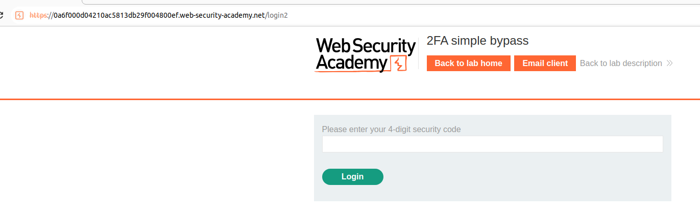
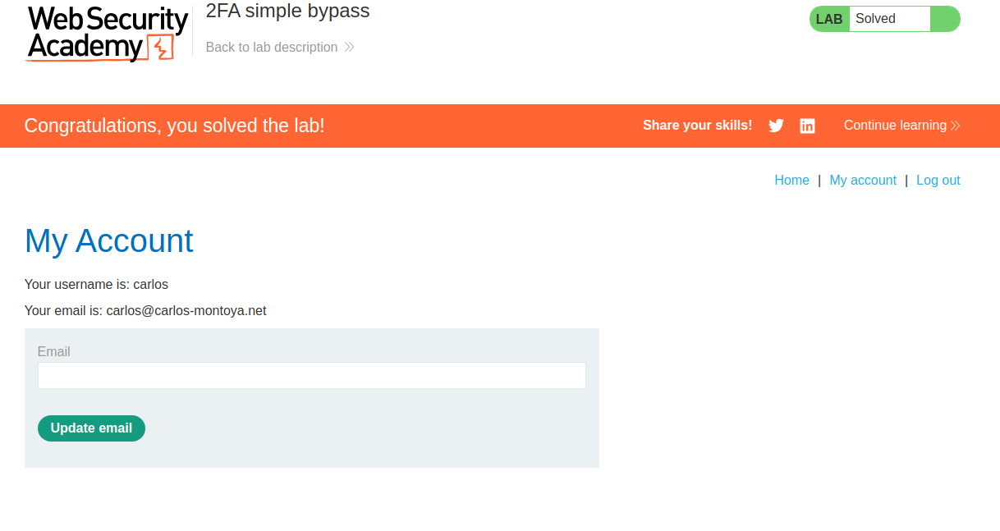

This bypass consist in basically omitting the second step of the multi-factor authentication and just logging in and going directly to the administration interface **without entering the asked code.**

When we log in as the user, we are redirected to this login page:

But what if we just go to /profile without inserting the code?
Well, we get into the profile as the second factor is not even enforcing anything:

