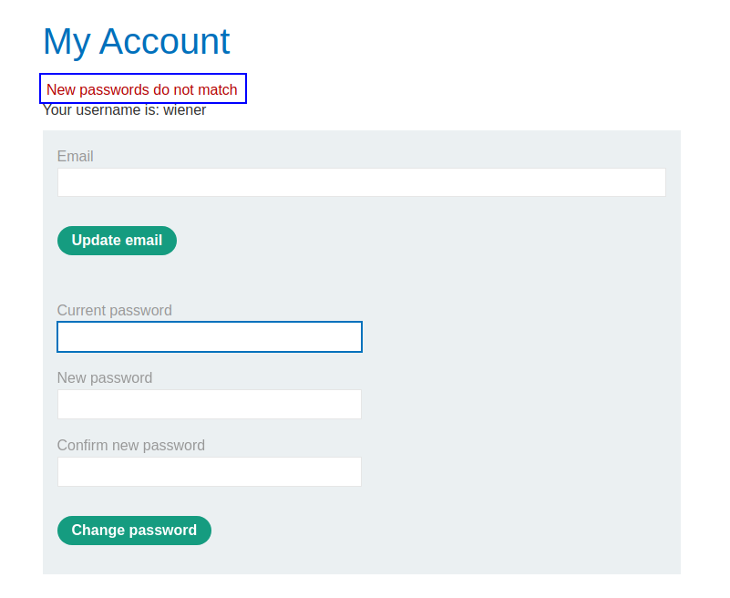
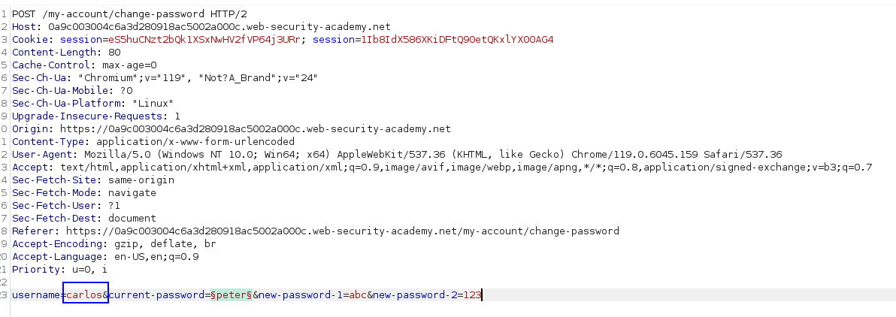
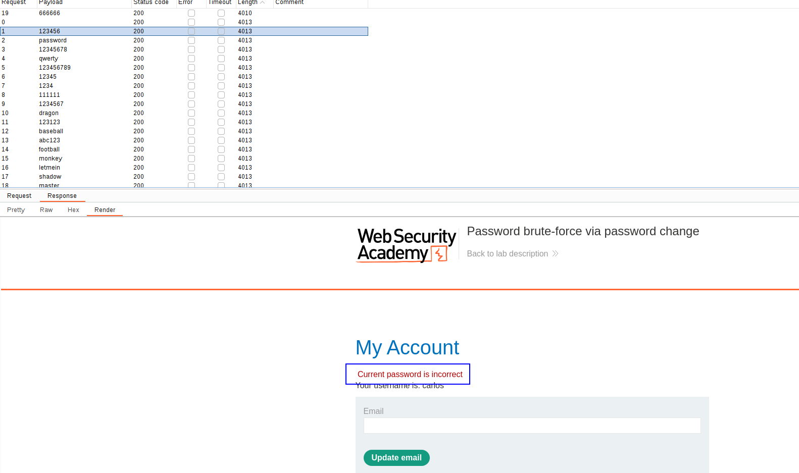
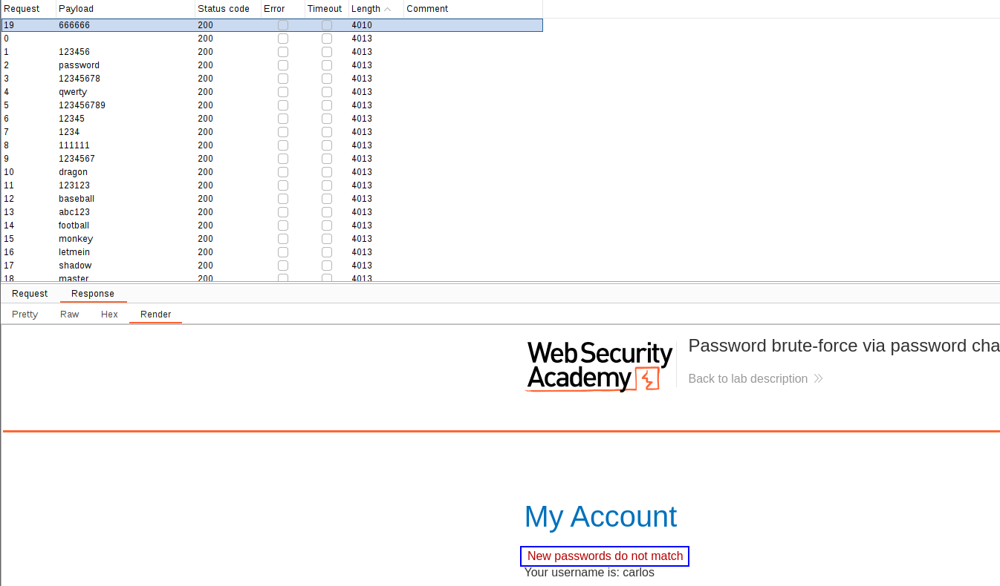
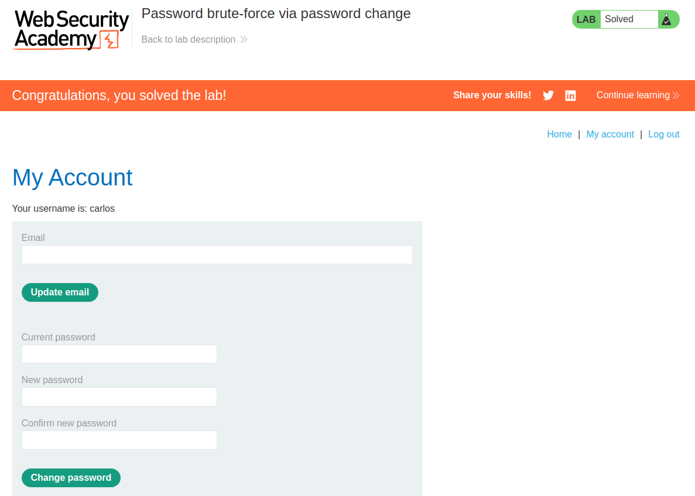

We can enumerate passwords of an user because of the following functionality:

If we insert a valid password but a different password for the confirmation1 and confirmation2, we get this message. We can try to enumerate valid passwords looking for this message, as the user is included as a parameter in the request:

This is when the password introduced is incorrect:

This is when the password introduced is correct: 

We can use this password to log in:

