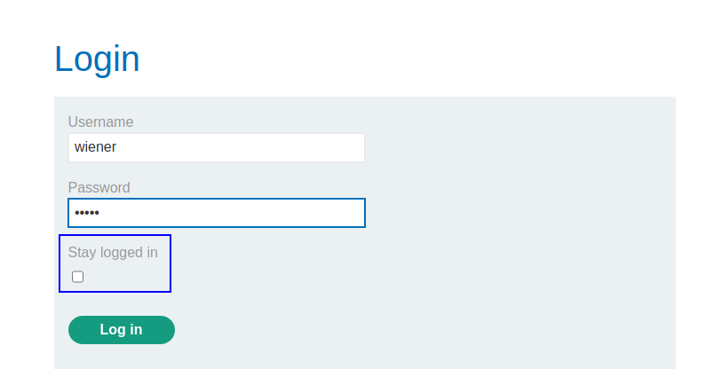
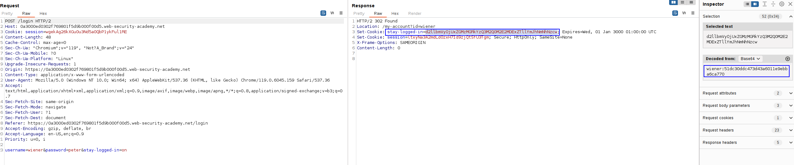
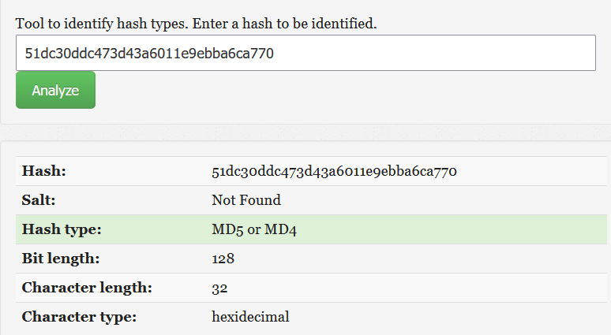
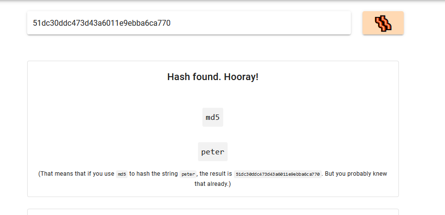
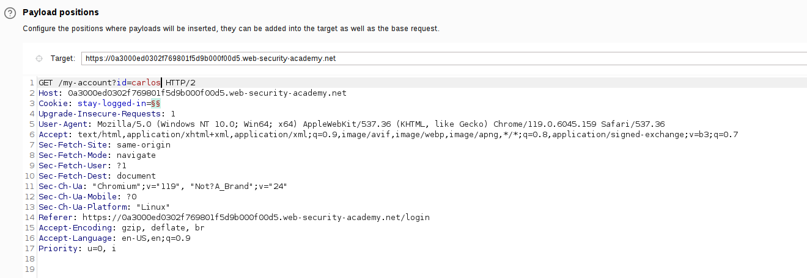
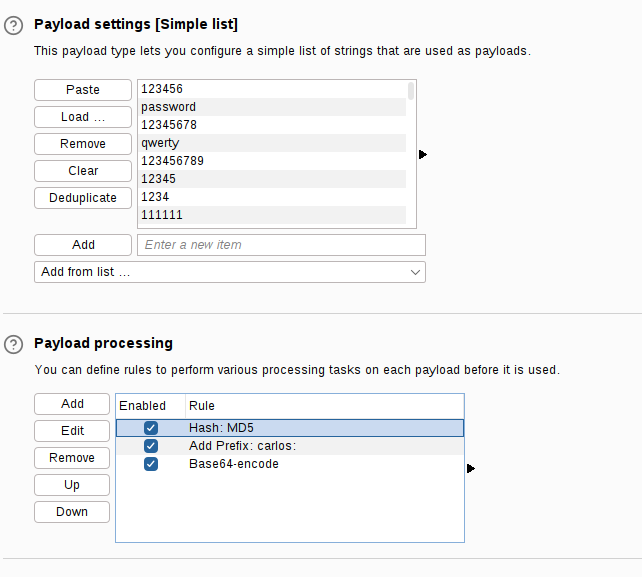
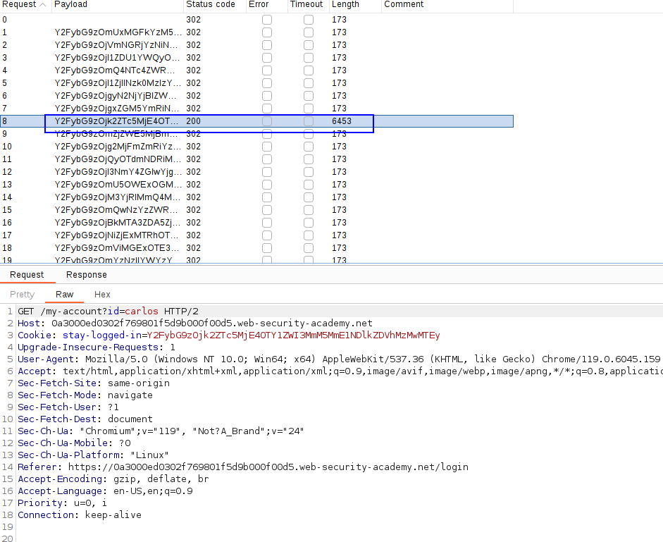
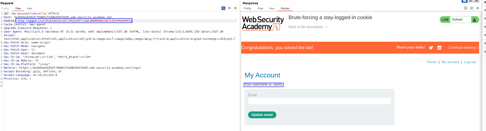

We have the option to stay logged in:

Let's see the cookie that the server gives us when we tick this option: 

We can see that is base64 of the user and then a big string. We have to see what is that long string. Based on the size it can be a hash,so let's copy it into a hash recognizer page:

It's probably MD5, let's hash the username or the password to see if it is any of those fields hashed:

We can see that is the password hashed, so let's just create a intruder attack using the wordlist and hashing MD5 the password before sending it:

Now we process the payload to add carlos:`<word>` and then MD5 that. `<word>` will be from the wordlist given by Burp Suite. Finally, base64 all the payload:

Now we send the attack and check which gives us a 200 OK:

This cookie is static and we can add it to be logged in as Carlos whenever we want.

