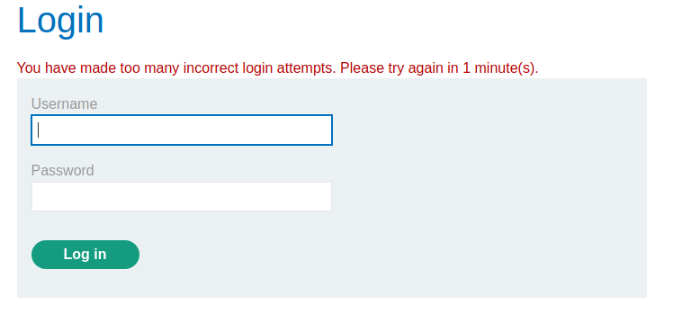
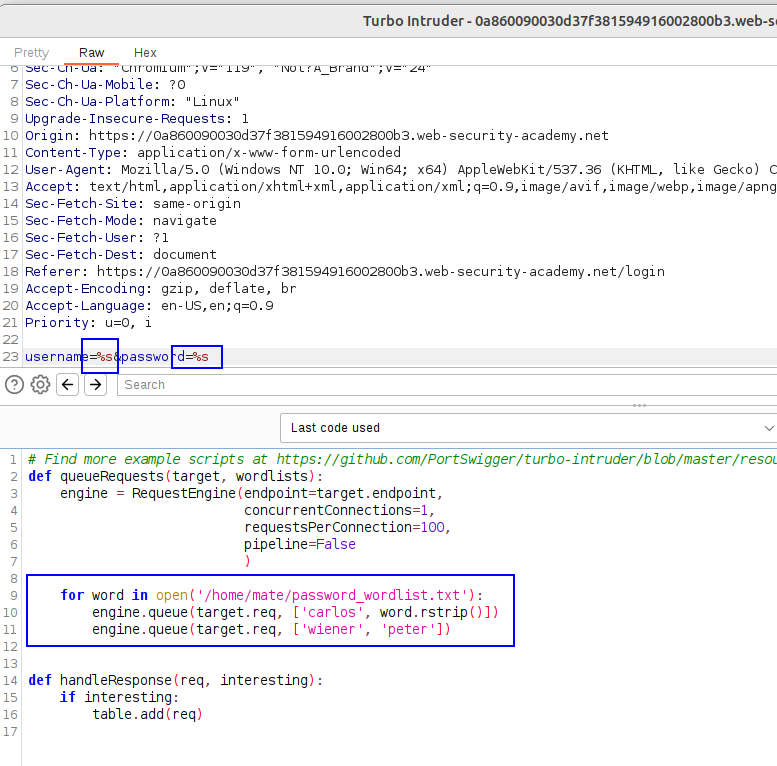
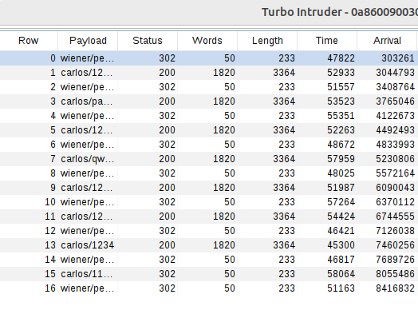
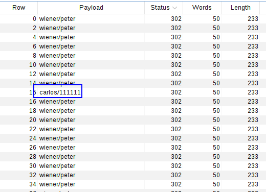
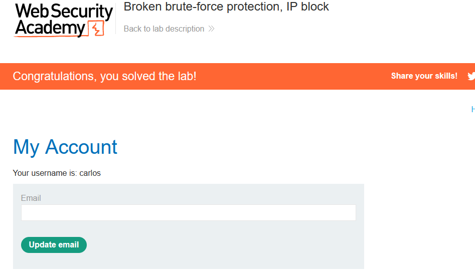

In this lab, we will perform a correct login every attempt so we bypass the IP blocking protection.
This protection is weak as it get resets every time a valid login is performed, therefore, we can reset it by login in with our user.

We can learn about Burp Suite's Turbo Intruder extension. This extension allows us to append our valid username:password combination for each of the attempts, in order to bypass the IP block verification.
We can see the block here:


We can't bypass it changing any header, but if we log in with `wiener:peter`BEFORE WE GET BLOCKED IN THE THIRD ATTEMPT and then we try to bruteforce, the block does not exist anymore.

This means that we can infinitely bruteforce if we try a user and then we log in with our user, as it will be constantly resetting the login counter. The trick is to never use three invalid combinations in a row.

For this, we will use the Turbo Intruder extension.
Taking a bit of the information here: 
https://github.com/frank-leitner/portswigger-websecurity-academy/tree/main/02-authentication/Broken_brute-force_protection%2C_IP_block

We first declare the two payload zones with `%s`, and we create a RequestEngine with 1 concurrent connection (important so it goes in the order of 1 valid combination per 1 bruteforce attempt).
Then, we say that we want toi open a wordlist and we include in the payload queue a bruteforce attempt of `carlos:PASSWORD`, and then a valid attempt `wiener:peter`:


We can see that, after attacking, we got a valid attempt per 1 bruteforce attempt:


We can see a 302 (redirect to profile) response for each of the valid attempts an then a 200 for each of the bruteforce attempts.
And therefore we bypass the detection technique.

This is the code used in the Turbo Intruder:
```python
# Find more example scripts at https://github.com/PortSwigger/turbo-intruder/blob/master/resources/examples/default.py
def queueRequests(target, wordlists):
    engine = RequestEngine(endpoint=target.endpoint,
                           concurrentConnections=1,
                           requestsPerConnection=100,
                           pipeline=False
                           )
                           
    for word in open('/home/mate/password_wordlist.txt'):
        engine.queue(target.req, ['wiener', 'peter'])
        engine.queue(target.req, ['carlos', word.rstrip()])


def handleResponse(req, interesting):
    if interesting:
        table.add(req)
```

We can see a 302 redirect to profile page with a combination of `carlos:11111`:



