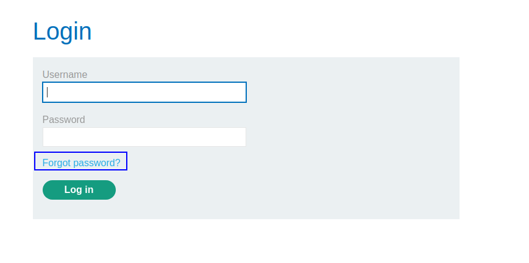
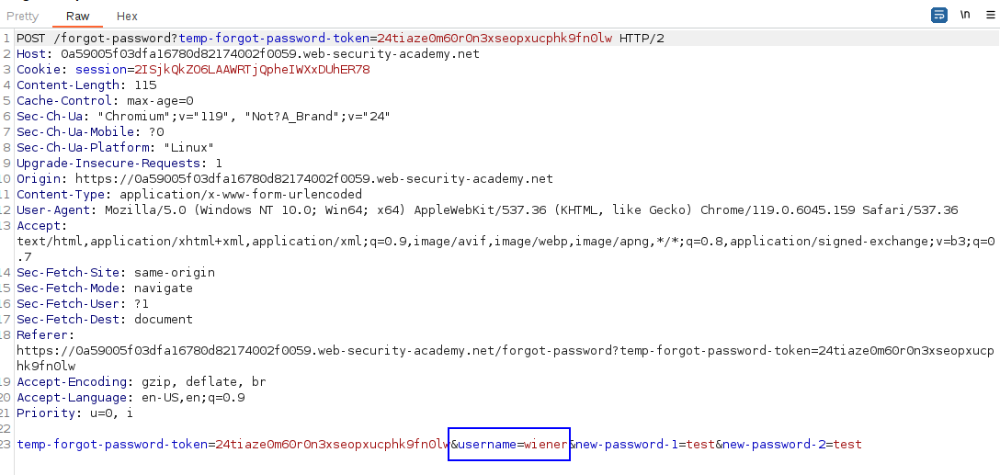
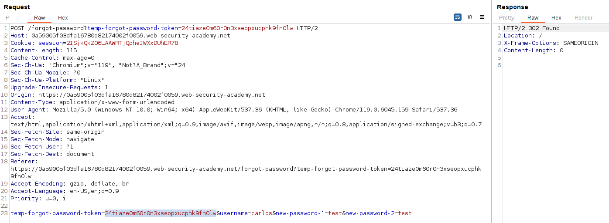
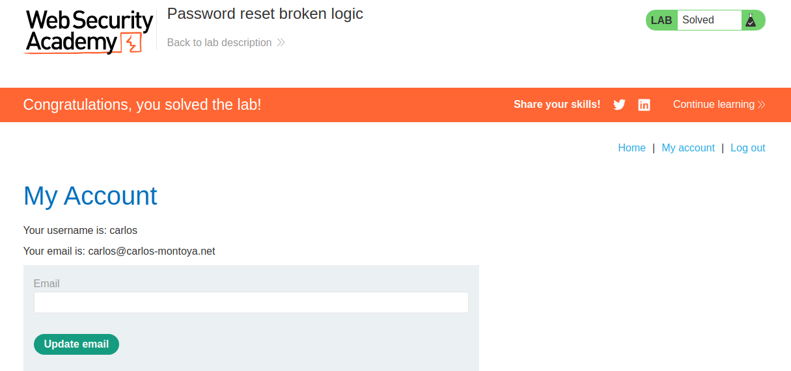

This lab is so simple. Just click on "Forgot password":

We introduce our username to get an email from which we can reset the password. In the page, we can see that the request to change password includes the user that we want to change the password:

We can change the username to `carlos` and just change the password. If the system does not validate that the user matches the user in the token, we can change the password of `carlos`.

Just log in with the new password:
