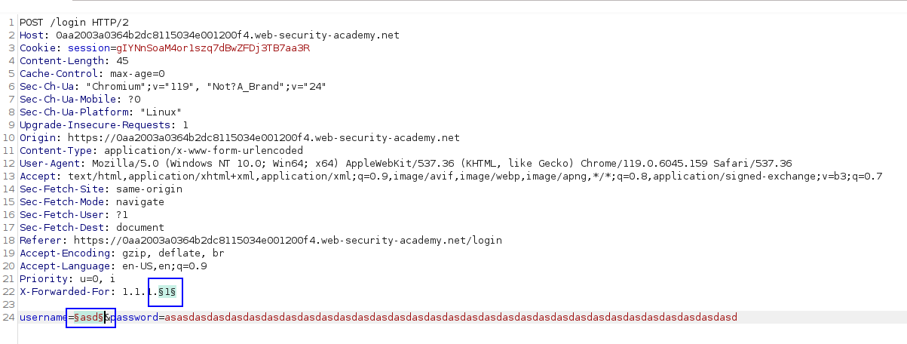
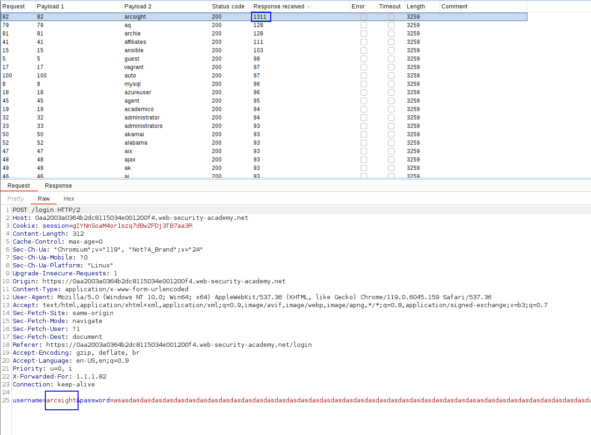
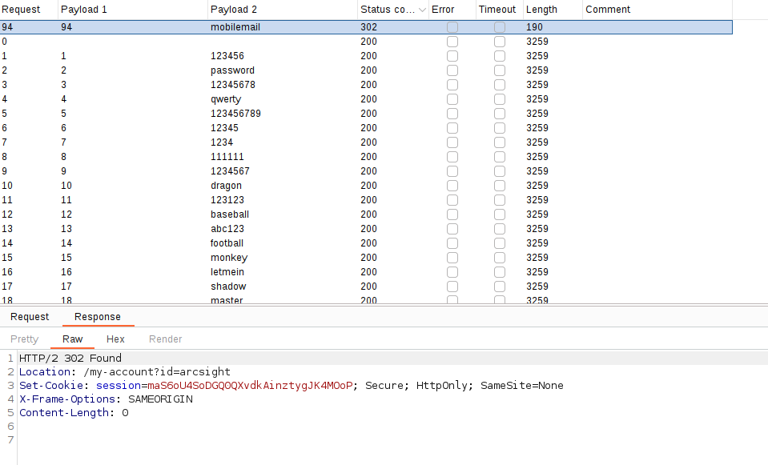
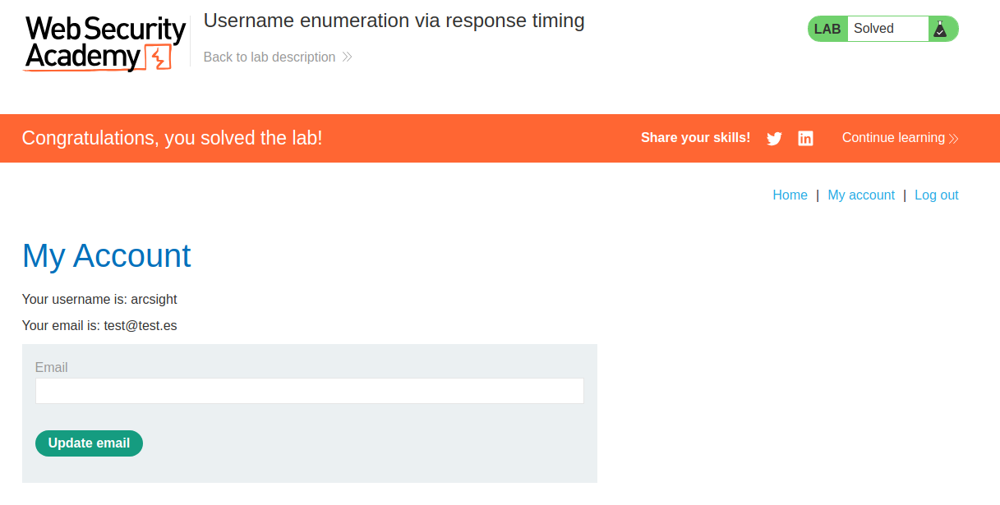

The important thing of this lab is that we can enumerate usernames because of the timing.
We have to notice **a factor that can be differential from a valid user and a wrong user.** 
In this case, the difference is that, when inserting a long password, the valid user takes a different time to respond than a wrong user. The longer the password, the more time difference.

Therefore, we will introduce **a long password so we can easily recognize which is the valid user.**
Also, the page has anti-bruteforce protections, but it accepts the X-Forwarded-For header, so we can spoof the IP address by manipulating this HTTP header.

We just send the request with a long password to the intruder:

And we make a Pitchfork attack, with numbers on the IP and the wordlist of users in the username field:

We can see that with `arcsight` the page has loaded much slower. That means that the user is probably valid and it made a larger comparation.

Let's bruteforce the password with that user to see if we get any valid login attempt:

We can see that we extracted a valid combination of user-password.

Learnt: You can bruteforce based on time, and not only based on response. Also, take into consideration factors that can affect the login attempt's response time, such as the password length or complexity.

