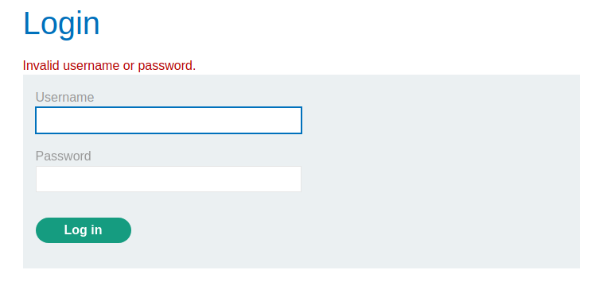

This lab is similar to [username_enumeration_subtle_different_responses](username_enumeration_subtle_different_responses.md) but is harder to see the difference of the response given between a valid and a wrong user.

This is that we get on a wrong user:

But now the concept is "Invalid username or password".
We will make a grep operation for this exact string:

And perform a bruteforce on the users based on this criteria to see which response is different:

Filtering by the column tells us that the response is different, a dot trail is missing. That can be translated as the user is probably valid, or different from the rest, which are invalid.

That means probably `apple:thomas` is the way to go here.

