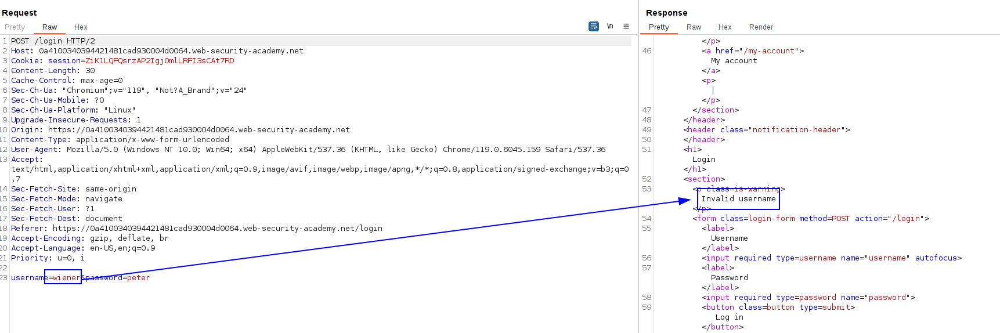
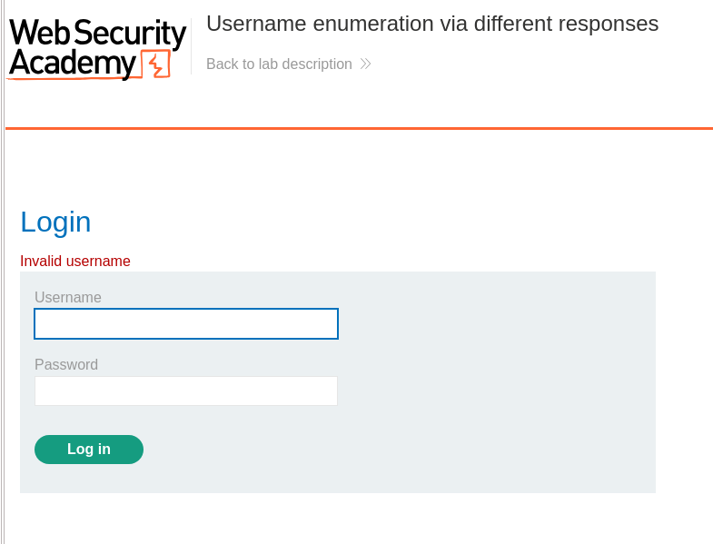
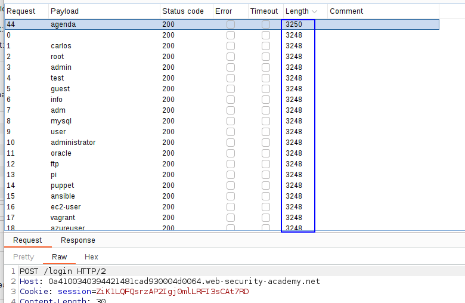
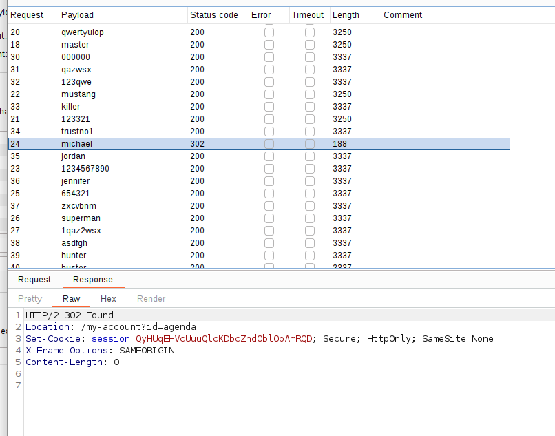
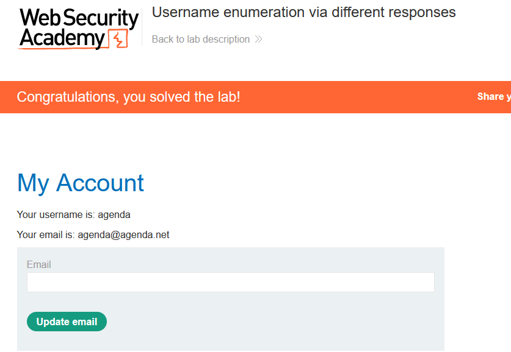

If we try to log in with an user that does not exist, the response includes "Invalid username":

Let's use the wordlist to enumerate users:

We can see that with the username `agenda`, we get a different response that does not include the "Invalid username".
The next step is to bruteforce the password:

With `michael` we get redirected to `/my-account?id=agenda`, which means we probably logged in. Let's try:

