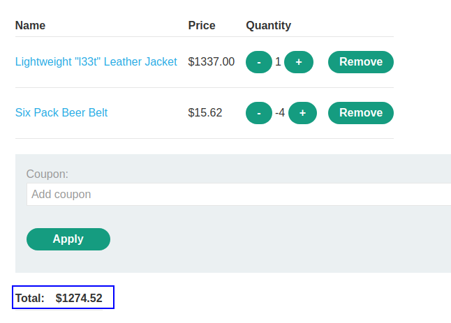

The client sends in the request the price of the item, so it is modifiable by the user and it is not validated in the server:

Sending this request leads to the item added in the basket with the modified price and we can buy it now:

In the next level of the lab, the price is not send in the request:

So we need to find how to exploit this and buy the item in other way. We are going to try to modify the `quantity`  value to a negative one, so maybe we can buy "negative" items and we can obtain money instead of losing money.
Let's buy -5 items:

In the cart we can see that we have -4 items (we had 1, minus 5), and there was no server-side validation, so we can buy the items and earn money:

But we have this error:

That means we cannot have a negative value in the cart. But we can manipulate the value of the cart, as we can put the item we want to buy and then negative items in the quantity so we have enough money to pay it. 

In the case of the glasses, it is 1337 dollars and we have 100 dollars to pay, so the cart value must be between 0 and 100. We can add the glasses and then add negative items so the payment is between 0 and 100, and we can pay it.

For example, with 4 negative items we can see that the price has been reduced:

Let's add 82 negative items:

We can now pay the item:

And we solved the lab.
