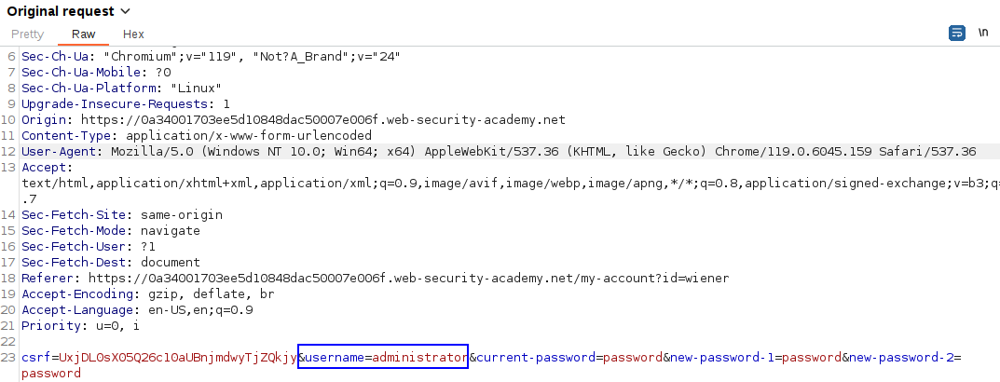
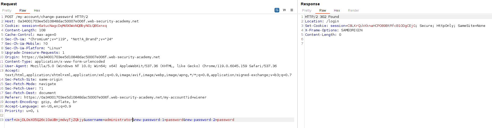

We can change our password, but the user to which we change the password is determined by a parameter:

We can try to change the `username` to administrator, but it says that the current provided password for the administrator is invalid.
If the server is not validating the existence of this parameter, we can try to change the password of the user without providing it:

We can see that we modified the password of an user without knowing it. Now we can access as the administrator and delete the user.
