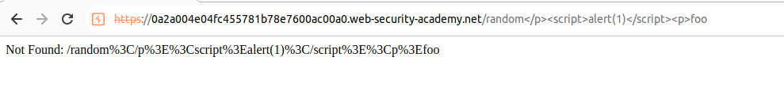
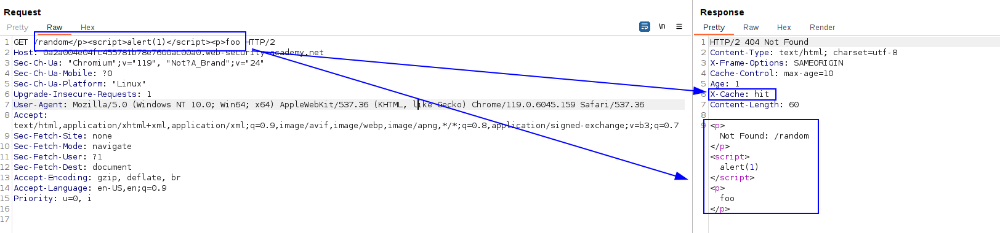
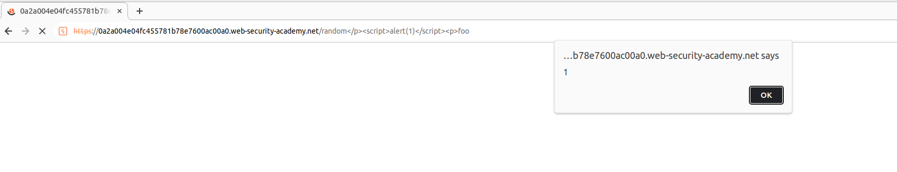

If we try to perform this XSS directly we can't as the browser URL encodes the request:

But this request gets keyed:

If we now visit the URL, the cache loiads the request and decodes the parameters, which results in the alert being executed as the cache is decoding the request:
