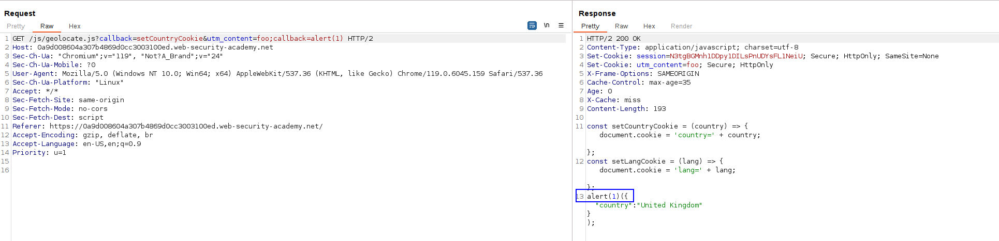

To scan for the parameter cloaking just right click in the request and click on "Rails parameter cloaking scan".

The payload used knowing that the `utm_content` header can be used to cloak:
`GET /js/geolocate.js?callback=setCountryCookie&utm_content=foo;callback=alert(1)`

This basically uses the `utm_content` to avoid the `callback` parameter to be treated as the cache key and uses the second declared value.
