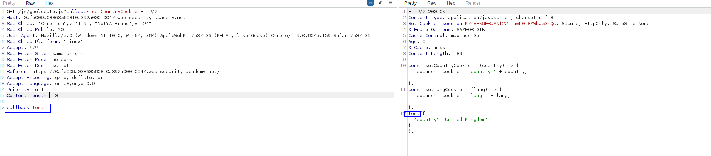
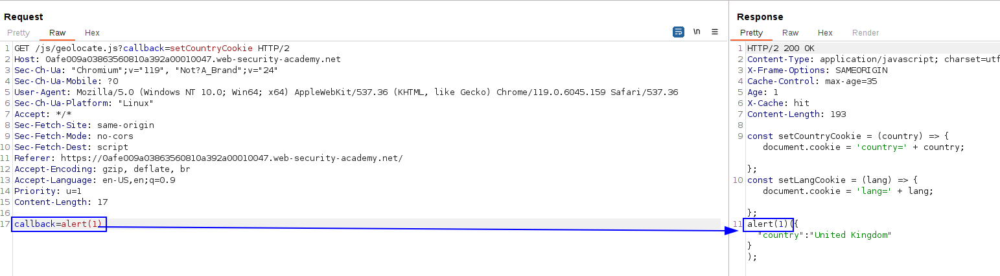

This website accepts `GET` requests that have a body, but does not include the body in the cache key. A user regularly visits this site's home page using Chrome.

We can see that we include the `callback` parameter in the request and it gets taken instead of the GET parameter. This is a FAT GET REQUEST:

We just add `alert(1)` as the payload.

