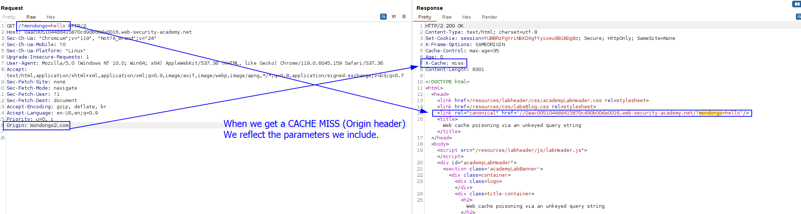

We first need to see the cache oracle, the home page has a cache header, which tells us that probably this is a cache oracle:

Let's find one header that is a cache buster (that affects in the cache). We can see that the `Origin` header is a cache buster. More than that, when the `x-Cache` is a `miss`, we get the parameters that we include in the URL reflected:

Indeed, we can perform a XSS attack inside the reflected area if we do the following payload:
`'/>`
Therefore, we just have to add a parameter in the request so the cache gets poisoned: 

Now, delete the Origin header as we want to match the cache key of the normal user, that won't specify any origin:

Now, the payload is being reflected and let's try it, as a normal user, refresh the home page:
