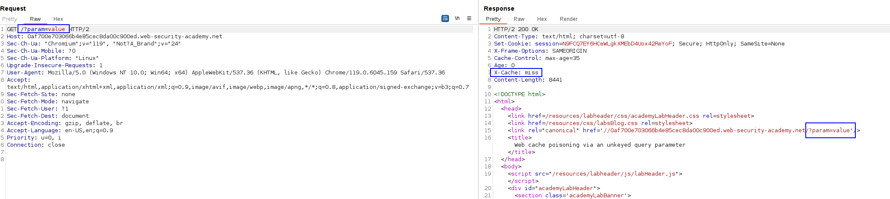
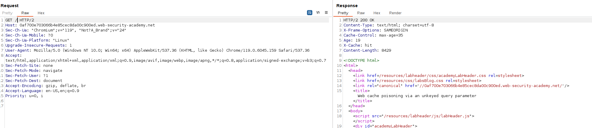
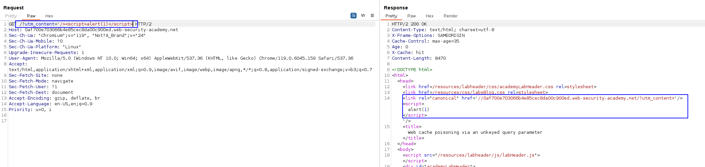
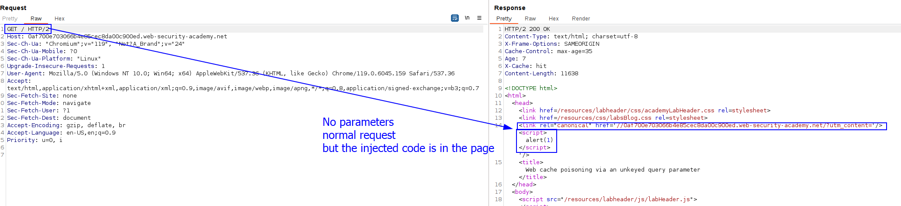

Here, not the whole query string is keyed. There are some tracking parameters that usually not get cached, like the `?utm_content` parameter.

If we submit any new parameter combination, we always get a `X-Cache=miss` header, meaning that the parameters are keyed:

They are also reflected. We need to find a parameter that **GETS REFLECTED BUT IS NOT PART OF THE KEY, SO THE USER DOES NOT HAVE TO INSERT IT**, so the `utm_content` works (this was a hint in the lab). this parameter gets reflected and is not keyed, so we can add it into the `GET /` request and it gets reflected.

Normal request:

Request with `utm_content`:

We have inserted it BUT, if we delete it from the request, (we do a simple `GET /` WITHOUT PARAMETERS, AS THE USER WOULD DO), we can see this gets displayed. That means that it was not a key:

