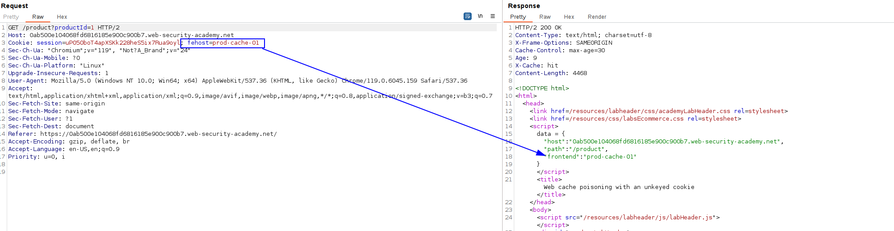
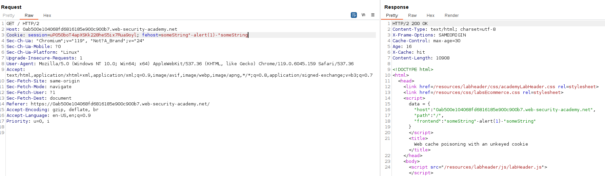

The cookie is unkeyed, and its value is also added in some javascript code (we have to perform XSS):

There is the cookie value, let's use the scan insertion point to see if we get any valid payload, but it does not return a valid payload.

So we just make the XSS manually, pretty easy, just concatenate with operators as we are inside a `script` evaluation, and remember to close quotes accordingly:

Just append this cookie in the `/` section and wait for the client to visit the page.

