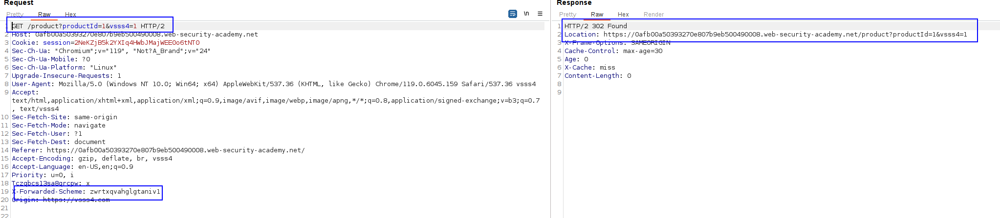

There are TWO non keyed headers that are important in this lab. 

The first one is the `X-Forwarded-Scheme` header, which is hidden but if we add it, and specify **other value than "https"**, we get redirected to the page we retrieved but in HTTPS:

It would be good to be able to manipulate this redirection, true? Well, it is possible. If we ALSO add the `X-Forwarded-Host`header, we get redirected to HTTPs, BUT TO THE DOMAIN SPECIFIED IN THE HEADER!

Therefore, we have it: We can point to any resource we want.

Let's do this for the main page, which is the page which the user will click. We need to cache the payload there.
Hosting `alert(document.cookie)` in the route in our exploit server and just cache the response.

