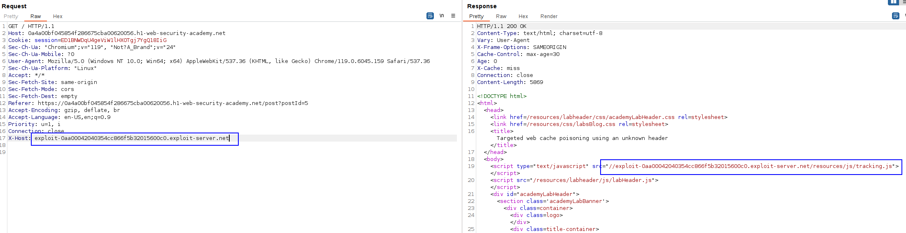

Here we have to make sure that the response is served to the specific subset of users to which the intended victim belongs. That means that **probably the user-agent header is a key header, and we have to guess it in order to be able to deliver the payload to the victim.** 

First, we used param miner on the part of the page we know that the cache attack is (the main page, where the user visits). Param miner detects a secret input in the form of the `X-Host` header:

We can already specify our exploit server address in this header and serve a malicious payload.

The next step is to know the user-agent of the victim, as that is a cache key. How do we know it? Because the response of the server has a `Vary` header indicating that the User-Agent header is a cache key: 

In order to know that, we have a place where we can perform a XSS attack: the comment page.
Adding a simple script that makes a GET request to our exploit server or collaborator will make the client make this request and therefore return its User-Agent so we can cache the attack. 

The XSS payload used is simple:
``

We can see the request containing the User-Agent header: 

Copy this user agent and add it into the request. This will finish all the steps:
