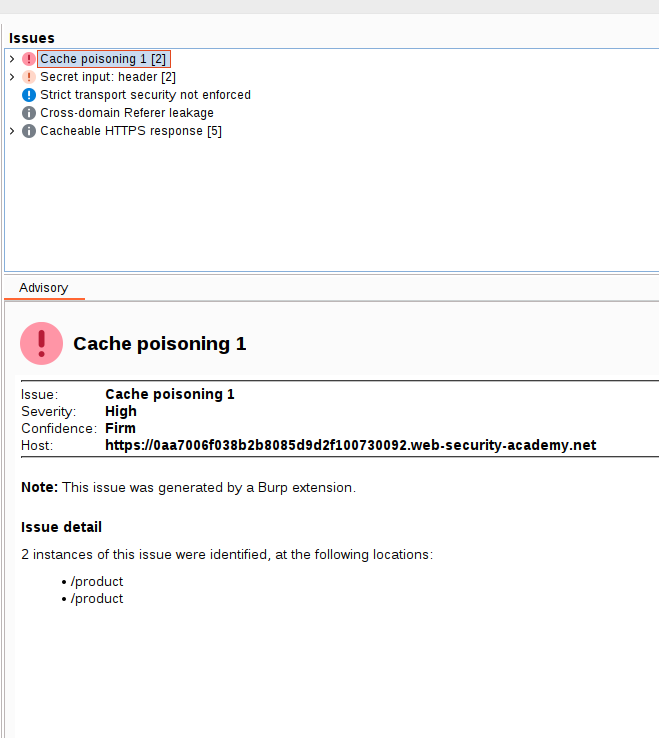
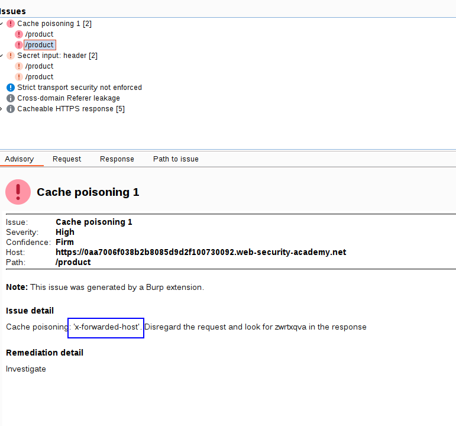
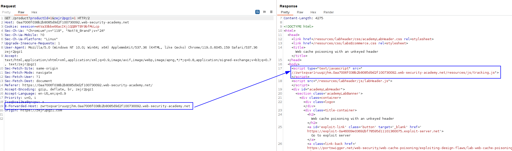
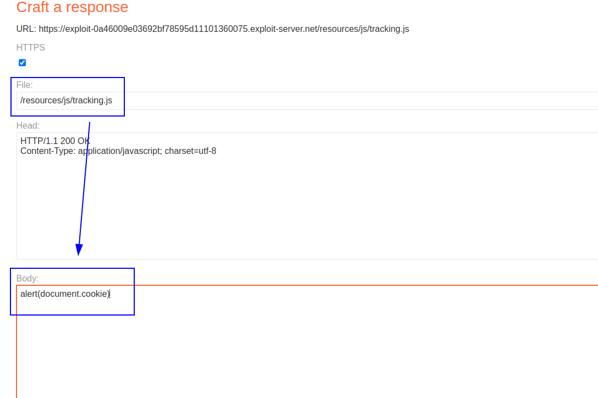
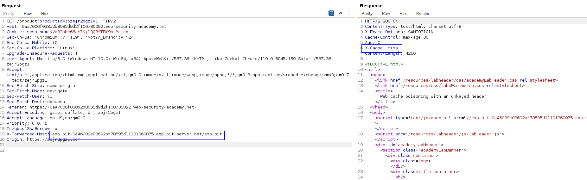
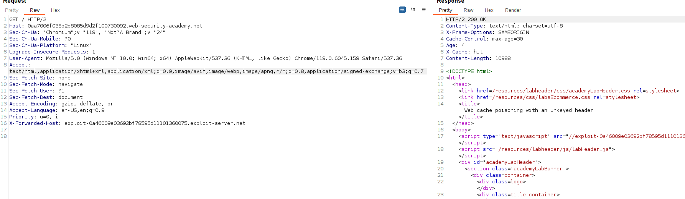
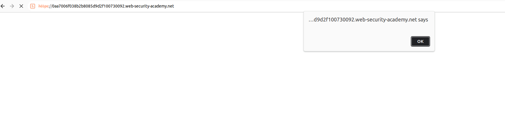

This lab has a header that is unkeyed and that is reflected on page.
The result? XSS.

By using param miner we know we have a cache poisoning vulnerability:

Now we have to determine the parameter. The extension tells us: 

We can see here how the header affects in the script: 

We have to create a XSS from here. We can point to our exploit server and add that file, and inside that file host a `alert(document.cookie)`. Let's do it!

Serving a XSS file on exploit server:

Changing the header so it stores the exploit server:

We can see a cache miss, that means that it is stored now. The next time we visit, there is an XSS.
But we cached the `GET /product?productId=1&asidkasd=1`, we need to cache `/`as that is what the victim visits. Let's just add this malicious unkeyed header to `GET / `so it gets cached:

Visiting home leads to an XSS:

