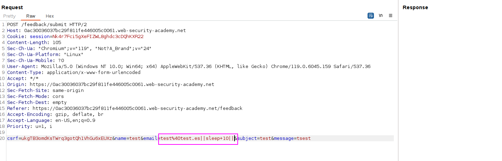
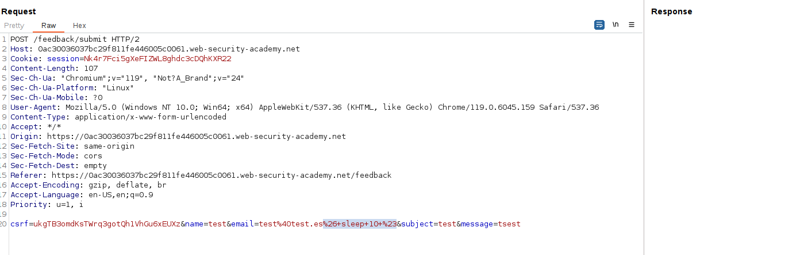

We append the following blind payload:
`test%40test.es||sleep+10||`

Personally, I do not like this, and I prefer the following payload that just appends the command `sleep` and then comments the rest:
`& sleep 10 #`
This will comment the rest of the bash command and make the command usable.
Without the comment the command does not work.

