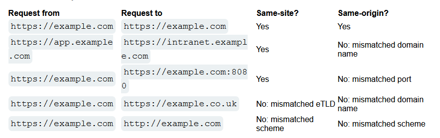

# What is Cross-Site Request Forgery
CSRF is a web vulnerability that allows attackers to **forge web requests** to users and induce them to perform actions **on the context of that user**, actions that they do not intend to perform.

Sames as XSS, they circumvent the same origin policy, which is a security mechanism to avoid websites from different origin talking between each other.

# What is the impact of a CSRF attack
Basically, a CSRF attack means that an user executes an action in a website unintentionally. Typical actions are changing the email address of the account, or the password, or to make a funds transfer... Depending on the application, the forged request will be different.

# Conditions for CSRF to happen
For a CSRF attack to be possible, three key conditions must be in place:

- **A relevant action.** There is an action within the application that the attacker has a reason to induce. This might be a privileged action (such as modifying permissions for other users) or any action on user-specific data (such as changing the user's own password).
- **Cookie-based session handling.** Performing the action involves issuing one or more HTTP requests, and the application relies solely on session cookies to identify the user who has made the requests. There is no other mechanism in place for tracking sessions or validating user requests.
- **No unpredictable request parameters.** The requests that perform the action do not contain any parameters whose values the attacker cannot determine or guess. For example, when causing a user to change their password, the function is not vulnerable if an attacker needs to know the value of the existing password. **The most common defense for CSRF** is an anti-CSRF token that gets included in the requests and depends on the user. The attacker cannot craft this token as he doesn't know the value (unless he is performing an XSS attack, in which he can retrieve it as he is in the context of the user's session).
# How does CSRF work?
For example, suppose an application contains a function that lets the user change the email address on their account. When a user performs this action, they make an HTTP request like the following:

```http
POST /email/change 
HTTP/1.1 
Host: vulnerable-website.com 
Content-Type: application/x-www-form-urlencoded 
Content-Length: 30 
Cookie: session=yvthwsztyeQkAPzeQ5gHgTvlyxHfsAfE 

email=wiener@normal-user.com
```

This meets the conditions required for CSRF:
- The action of changing the email address on a user's account is of interest to an attacker. Following this action, the attacker will typically be able to trigger a password reset and take full control of the user's account.
- The application uses a session cookie to identify which user issued the request. There are no other tokens or mechanisms in place to track user sessions.
- The attacker can easily determine the values of the request parameters that are needed to perform the action.

With these conditions in place, the attacker can construct a web page containing the following HTML:
```html
<html>
  <body>
    <form action="https://vulnerable-website.com/email/change" method="POST">
      <input type="hidden" name="email" value="pwned@evil-user.net" />
    </form>
    <script>
      document.forms[0].submit();
    </script>
  </body>
</html>
```

If a victim user visits the attacker's web page, the following will happen:
- The attacker's page will trigger an HTTP request to the vulnerable web site.
- If the user is logged in to the vulnerable web site, their browser will automatically include their session cookie in the request (assuming [SameSite cookies](https://portswigger.net/web-security/csrf#common-defences-against-csrf) are not being used). This is the mechanism of defense for CSRF and XSS.
- The vulnerable web site will process the request in the normal way, treat it as having been made by the victim user, and change their email address.

# How to construct a CSRF attack
Manually creating the HTML needed for a CSRF exploit is sometimes boring, particularly when the request to forge contains a large number of parameters, or there are other particularities in the request.

Because of that, the easiest way to construct a CSRF exploit is using the CSRF PoC generator built in to Burp Suite Professional.
In order to learn how to use it, here is the first CSRF lab to try it: [csrf_with_no_defenses](labs/csrf_with_no_defenses.md)

# How to deliver a CSRF exploit
The delievry mechanisms for CSRF attacks are esentially the same as for reflected XSS. The attacker knows the site where he can craft the request, places the malicious HTML onto a site **they control**, and **then induce victims to enter the site, via phishing or whatever. Also, an attacker can be placed into a popular website as a XSS payload, and the victims will execute this payload too.**

Note that some simple CSRF exploits employ the GET method and can be fully self-contained with a single URL on the vulnerable web site. In this situation, the attacker may not need to employ an external site, and can directly feed victims a malicious URL on the vulnerable domain. In the preceding example, if the request to change email address can be performed with the GET method, then a self-contained attack would look like this:
``

## Common defences against CSRF
Nowadays, successfully finding and exploiting CSRF vulnerabilities often involves bypassing anti-CSRF measures deployed by the target website, the victim's browser, or both. The most common defenses you'll encounter are as follows:

- **CSRF tokens** - A CSRF token is a unique, secret, and unpredictable value that is generated by the server-side application and shared with the client. When attempting to perform a sensitive action, such as submitting a form, the client must include the correct CSRF token in the request. This makes it very difficult for an attacker to construct a valid request on behalf of the victim.
- **SameSite cookies** - SameSite is a browser security mechanism that determines when a website's cookies are included in requests originating from other websites. As requests to perform sensitive actions typically require an authenticated session cookie, the appropriate SameSite restrictions may prevent an attacker from triggering these actions cross-site. Since 2021, Chrome enforces `Lax` SameSite restrictions by default. As this is the proposed standard, we expect other major browsers to adopt this behavior in future. 
- **Referer-based validation** - Some applications make use of the HTTP Referer header to attempt to defend against CSRF attacks, normally by verifying that the request originated from the application's own domain. This is generally less effective than CSRF token validation.

For a more detailed description of each of these defenses, as well as how they can potentially be bypassed, check out the following materials. These include interactive labs that let you practice what you've learned on realistic, deliberately vulnerable targets.

## What is the difference between XSS and CSRF?
[Cross-site scripting](https://portswigger.net/web-security/cross-site-scripting) (or XSS) allows an attacker to execute arbitrary JavaScript within the browser of a victim user.
[Cross-site request forgery](https://portswigger.net/web-security/csrf) (or CSRF) allows an attacker to induce a victim user to perform actions that they do not intend to.

The consequences of XSS vulnerabilities are generally more serious than for CSRF vulnerabilities:

- CSRF often only applies to a subset of actions that a user is able to perform. Many applications implement CSRF defenses in general but overlook one or two actions that are left exposed. Conversely, a successful XSS exploit can normally induce a user to perform any action that the user is able to perform, regardless of the functionality in which the vulnerability arises.
- CSRF can be described as a "one-way" vulnerability, in that while an attacker can induce the victim to issue an HTTP request, they cannot retrieve the response from that request. Conversely, XSS is "two-way", in that the attacker's injected script can issue arbitrary requests, read the responses, and exfiltrate data to an external domain of the attacker's choosing.

## Can CSRF tokens prevent XSS attacks?
Some XSS attacks can indeed be prevented through effective use of CSRF tokens. Consider a simple [reflected XSS](https://portswigger.net/web-security/cross-site-scripting/reflected) vulnerability that can be trivially exploited like this:
`https://insecure-website.com/status?message=<script>/*+Bad+stuff+here...+*/</script>`

Now, suppose that the vulnerable function includes a CSRF token:
`https://insecure-website.com/status?csrf-token=CIwNZNlR4XbisJF39I8yWnWX9wX4WFoz&message=<script>/*+Bad+stuff+here...+*/</script>`

Assuming that the server properly validates the CSRF token, and rejects requests without a valid token, then the token does prevent exploitation of the XSS vulnerability. The clue here is in the name: "cross-site scripting", at least in its [reflected](https://portswigger.net/web-security/cross-site-scripting/reflected) form, involves a cross-site request. By preventing an attacker from forging a cross-site request, the application prevents trivial exploitation of the XSS vulnerability.

Some important caveats arise here:

- If a [reflected XSS](https://portswigger.net/web-security/cross-site-scripting/reflected) vulnerability exists anywhere else on the site within a function that is not protected by a CSRF token, then that XSS can be exploited in the normal way.
- If an exploitable XSS vulnerability exists anywhere on a site, then the vulnerability can be leveraged to make a victim user perform actions even if those actions are themselves protected by CSRF tokens. In this situation, the attacker's script can request the relevant page to obtain a valid CSRF token, and then use the token to perform the protected action.
- CSRF tokens do not protect against [stored XSS](https://portswigger.net/web-security/cross-site-scripting/stored) vulnerabilities. If a page that is protected by a CSRF token is also the output point for a [stored XSS](https://portswigger.net/web-security/cross-site-scripting/stored) vulnerability, then that XSS vulnerability can be exploited in the usual way, and the XSS payload will execute when a user visits the page.

# Bypassing CSRF token validation
CSRF token are the most common defense for CSRF attacks, as it is easy to implement and have a good effect.
The CSRF token is an unique secret and unpredictable value that **the server generates and shares with the client. Each client has a CSRF token and the client must send this token when performing requests (at least, for sensitive actions).** Otherwise, if the ticket is not sent, the server does not process the request.

A common way to share CSRF tokens with the client is to include them as a hidden parameter in an HTML form, for example:
`<form name="change-email-form" action="/my-account/change-email" method="POST"> <label>Email</label> <input required type="email" name="email" value="example@normal-website.com"> <input required type="hidden" name="csrf" value="50FaWgdOhi9M9wyna8taR1k3ODOR8d6u"> <button class='button' type='submit'> Update email </button> </form>`
Note that this is not the only form; they can be sent in HTTP headers, for example.

Submitting this form results in the following request:
`POST /my-account/change-email HTTP/1.1 Host: normal-website.com Content-Length: 70 Content-Type: application/x-www-form-urlencoded csrf=50FaWgdOhi9M9wyna8taR1k3ODOR8d6u&email=example@normal-website.com`
We can see the CSRF token in the body of the request.

What is hard is really **PREDICTING** the value of the CSRF token; if the token is short or predictable, or based on the user's info, it may be easy to craft. The idea is to have a large string.

Let's see some common mistakes in CSRF token validation:

## Flaw #1: Validation of CSRF token depends on request method
It is common to validate POST requests but not validate GET requests. 
In that case, the attacker can switch to the GET method to bypass the validation and deliver a CSRF attack.
Lab that covers this flaw: [csrf_bypass_token_validation_in_request_method](labs/csrf_bypass_token_validation_in_request_method.md)

## Flaw #2: Validation of CSRF token depends on token being present
Some applications validate the token if it is inserted but skip the validation process if the whole token field is omitted in the request.
In that situation, an attacker can **remove the entire parameter containing the token, not only its value, to bypass the validation and deliver a CSRF attack:**
Lab that covers this flaw: [csrf_bypass_deleting_token](labs/csrf_bypass_deleting_token.md)

## Flaw #3: CSRF token is not tied to user session
Sometimes, the server has a pool of CSRF tokens and the server only checks if the token comes from the pool. In that case, the attacker can **obtain a valid CSRF token from its session and attach this token into the CSRF PoC.**
Lab that covers this flaw: [csrf_bypass_token_not_tied_to_session](labs/csrf_bypass_token_not_tied_to_session.md)

## Flaw #4: CSRF token is tied to a non-session cookie
As a variation of Flaw #3, some applications do **tie the CSRF token to a cookie**, but no to the same cookie that is used to track sessions. That means that there is no relationship between the user's session cookie and the CSRF cookie, and an attacker can do the same as before: obtain the CSRF cookie and attach it to the requests.
Lab that covers this flaw: [csrf_bypass_token_attached_to_cookie](labs/csrf_bypass_token_attached_to_cookie.md)

## Flaw #5: CSRF token is duplicated in a cookie
In this case, we have Flaw #4 but the value of the CSRF token is the same in both sites. The server just **checks if the value of the CSRF token is the same in both sites. If there is an attack vector to set an user's cookie, an attacker can set whatever token (in a valid format), leverage the cookie-setting behavior to place their cookie into the victim's browser, and feed their token to the victim in their CSRF attack**.
Lab that covers this flaw: [csrf_bypass_token_duplicated_in_cookie](labs/csrf_bypass_token_duplicated_in_cookie.md)


## Bypassing SameSite cookie restrictions
`SameSite` is a browser security mechanism that determines **if the cookies are included in the requests originating from other websites. `SameSite` provides protection amongst a variety of cross-site attacks, such as CORS, CSRF and XSS.** This parameter is per cookie.
Since 2021, Chrome applies `Lax` SameSite restrictions by default if the website that issues the cookie doesn't explicitly set its own restriction level. This is a proposed standard, and we expect other major browsers to adopt this behavior in the future. As a result, it's essential to have solid grasp of how these restrictions work, as well as how they can potentially be bypassed, in order to thoroughly test for cross-site attack vectors.

### What is a site in the context of SameSite cookies?
In the context of SameSite cookie restrictions, a site is defined as the top-level domain (**TLD**), usually something like `.com` or `.net` **plus one additional level of the domain name. This is often referred as the TLD + 1 (TLD plus one hierarchy more)**.

When determining whether a request is same-site or not, the URL scheme  (`http` or `https`) is also taken into consideration. This means that a link from `http://app.example.com` to `https://app.example.com` is treated as cross-site by most browsers.


An origin is not the same as a site. A site is more lax, as it involves multiple domain names (for example, `example1.app.com` and `example2.app.com` is the same site as the TLD+1 is the same, `app.com`). On the other side, URLs are considered to have the same origin if they share the exact same scheme, domain name, and port. Although note that the port is often inferred from the scheme.

These are good examples of the differences between Same-site and Same-origin:

### How does SameSite work?
Before the SameSite mechanism was introduced, browsers sent cookies in every request to the domain that issued them, even if the request was triggered by an unrelated third-party website. SameSite works by enabling browsers and website owners to limit which cross-site requests, if any, should include specific cookies. This can help to reduce users' exposure to CSRF attacks, which induce the victim's browser to issue a request that triggers a harmful action on the vulnerable website. As these requests typically require a cookie associated with the victim's authenticated session, the attack will fail if the browser doesn't include this.
All major browsers currently support the following SameSite restriction levels:

- [`Strict`](https://portswigger.net/web-security/csrf/bypassing-samesite-restrictions#strict)
- [`Lax`](https://portswigger.net/web-security/csrf/bypassing-samesite-restrictions#lax)
- [`None`](https://portswigger.net/web-security/csrf/bypassing-samesite-restrictions#none)

Developers can manually configure a restriction level for each cookie they set, giving them more control over when these cookies are used. To do this, they just have to include the `SameSite` attribute in the `Set-Cookie` response header, along with their preferred value:
`Set-Cookie: session=0F8tgdOhi9ynR1M9wa3ODa; SameSite=Strict`

Although this offers some protection against CSRF attacks, none of these restrictions provide guaranteed immunity, as we'll demonstrate using deliberately vulnerable, interactive labs later in this section.

### `SameSite=Strict` cookies
If a cookie is set with the `SameSite=Strict` attribute, browsers will not send it in any cross-site requests. In simple terms, this means that if the target site for the request does not match the site currently shown in the browser's address bar, it will not include the cookie.
This is recommended when setting cookies that enable the bearer to modify data or perform other sensitive actions, such as accessing specific pages that are only available to authenticated users.
Although this is the most secure option, it can negatively impact the user experience in cases where cross-site functionality is desirable.

#### Bypassing SameSite Strict restrictions using on-site gadgets
If a cookie is set with the `SameSite=Strict` attribute, browsers won't include it in any cross-site requests. You may be able to get around this limitation if you can find a gadget that results in a secondary request within the same site.

The idea is to create a secondary request that will include all cookies related to the site. The way to perform a secondary request is finding a gadget that allows us to create a client-side redirect that is treated like a normal request, but adding all cookies.
Lab that covers this topic: [csrf_samesite_strict_bypass_client_side_redirect](labs/csrf_samesite_strict_bypass_client_side_redirect.md)

### SameSite=Lax cookies
`Lax` SameSite restrictions mean that browsers will send the cookie in cross-site requests, but only if both of the following conditions are met:

- The request uses the `GET` method.    
- The request resulted from a top-level navigation by the user, such as clicking on a link.

This means that the cookie is not included in cross-site `POST` requests, for example. As `POST` requests are generally used to perform actions that modify data or state (at least according to best practice), they are much more likely to be the target of CSRF attacks.

Likewise, the cookie is not included in background requests, such as those initiated by scripts, iframes, or references to images and other resources.

One attack path is to use a GET request so the cookie is included in our CSRF.
In practice, servers aren't always fussy about whether they receive a `GET` or `POST` request to a given endpoint, even those that are expecting a form submission. If they also use `Lax` restrictions for their session cookies, either explicitly or due to the browser default, you may still be able to perform a [CSRF attack](https://portswigger.net/web-security/csrf) by eliciting a `GET` request from the victim's browser.

As long as the request involves a top-level navigation, the browser will still include the victim's session cookie. The following is one of the simplest approaches to launching such an attack:

`<script> document.location = 'https://vulnerable-website.com/account/transfer-payment?recipient=hacker&amount=1000000'; </script>`

Here is a lab that covers this topic: [csrf_samesite_lax_bypass_get_method](labs/csrf_samesite_lax_bypass_get_method.md)

Another attack path is by creating a CSRF attack in the 120 first seconds, with **newly issued cookies.**
As mentioned earlier, if a website doesn't include a `SameSite` attribute when setting a cookie, Chrome automatically applies `Lax` restrictions by default. However, to avoid breaking single sign-on (SSO) mechanisms, **it doesn't actually enforce these restrictions for the first 120 seconds on top-level `POST` requests**. As a result, **there is a two-minute window in which users may be susceptible to cross-site attacks.**
Important: **This two-minute window does not apply to cookies that were explicitly set with the `SameSite=Lax` attribute.** This is for cookies that, **by default, are set to Lax as they are not explicitly declared.**

It's somewhat impractical to try timing the attack to fall within this short window. On the other hand, if you can find a gadget on the site that enables you to force the victim to be issued a new session cookie, you can preemptively refresh their cookie before following up with the main attack. For example, completing an OAuth-based login flow may result in a new session each time as the OAuth service doesn't necessarily know whether the user is still logged in to the target site.

To trigger the cookie refresh without the victim having to manually log in again, you need to use a top-level navigation, which ensures that the cookies associated with their current [OAuth](https://portswigger.net/web-security/oauth) session are included. This poses an additional challenge because you then need to redirect the user back to your site so that you can launch the CSRF attack.

Alternatively, you can trigger the cookie refresh from a new tab so the browser doesn't leave the page before you're able to deliver the final attack. A minor snag with this approach is that browsers block popup tabs unless they're opened via a manual interaction. For example, the following popup will be blocked by the browser by default:
`window.open('https://vulnerable-website.com/login/sso');`

To get around this, you can wrap the statement in an `onclick` event handler as follows:
`window.onclick = () => { window.open('https://vulnerable-website.com/login/sso'); }`

This way, the `window.open()` method is only invoked when the user clicks somewhere on the page.

## Bypassing `Referer` based CSRF defenses
Some applications make use of the HTTP `Referer` header as a measure to defend against CSRF attacks, normally by verifying if this referer comes from the application's own domain.
This approach is less effective and is often subject to bypasses.

First, let's talk a bit about the Referer header:
The HTTP Referer header (which is inadvertently misspelled in the HTTP specification) is an optional request header that contains the URL of the web page that linked to the resource that is being requested. It is generally added automatically by browsers when a user triggers an HTTP request, including by clicking a link or submitting a form. Various methods exist that allow the linking page to withhold or modify the value of the `Referer` header. This is often done for privacy reasons.]

### Bypass Referer header #1: deleting the header
Some applications validate the `Referer` header when it is present in requests but skip the validation if the header is omitted.

In this situation, an attacker can craft their [CSRF exploit](https://portswigger.net/web-security/csrf) in a way that causes the victim user's browser to drop the `Referer` header in the resulting request. There are various ways to achieve this, but the easiest is using a META tag within the HTML page that hosts the [CSRF attack](https://portswigger.net/web-security/csrf):
`<meta name="referrer" content="never">`

Here is a lab that covers this topic: [csrf_bypass_referer_header_deleting_it](labs/imgs/csrf_bypass_referer_header_deleting_it.md)

### Bypass Referer header #2: changing the referer to our domain

Some applications validate the `Referer` header in a naive way that can be bypassed. For example, if the application validates that the domain in the `Referer` starts with the expected value, then the attacker can place this as a subdomain of their own domain:

`http://vulnerable-website.com.attacker-website.com/csrf-attack`

Likewise, if the application simply validates that the `Referer` contains its own domain name, then the attacker can place the required value elsewhere in the URL:
`http://attacker-website.com/csrf-attack?vulnerable-website.com`

