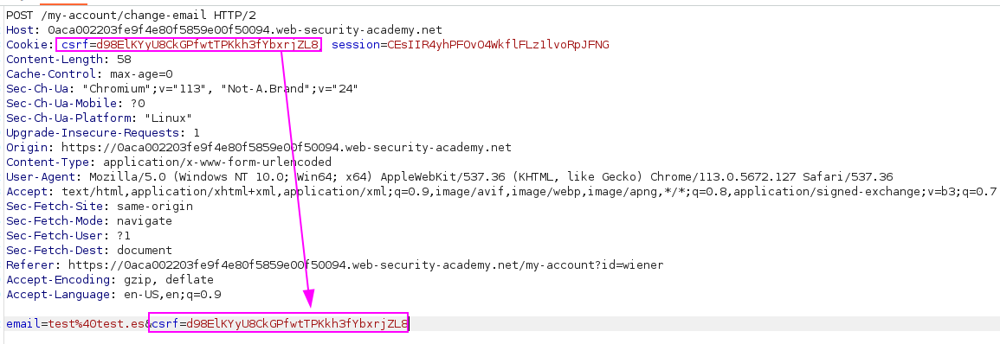
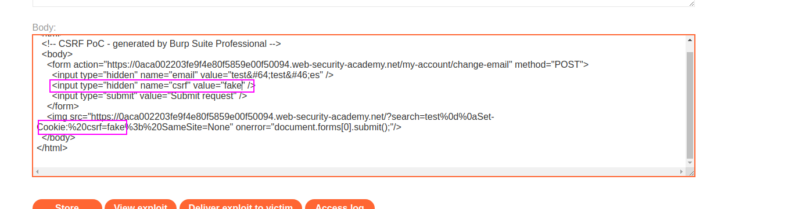
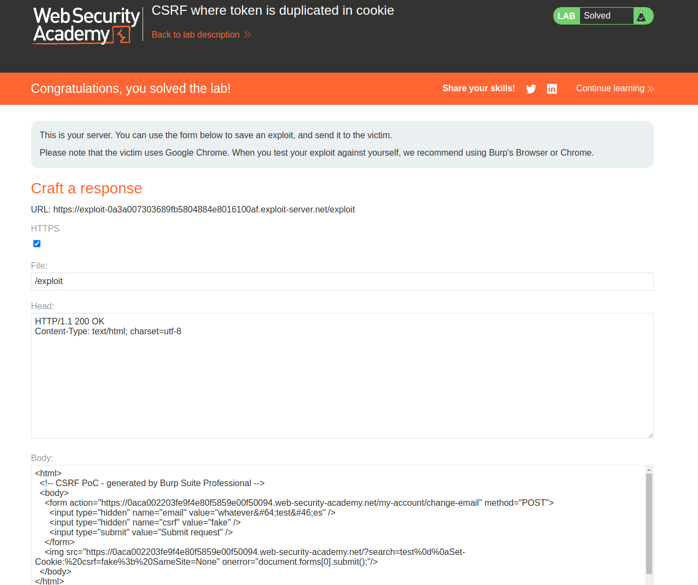

First, we can see that the CSRF token value matches in both fields:

Once we find the vulnerability that allows us to inject a cookie into the user's session, we just add the same cookie as the CSRF part of the form:

The request will set a csrf cookie called "fake" and then send a POST form with the CSRF token with the same value.

