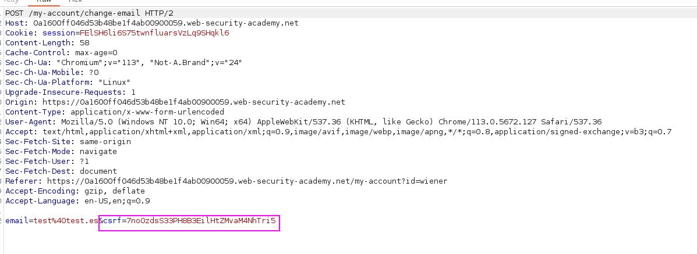
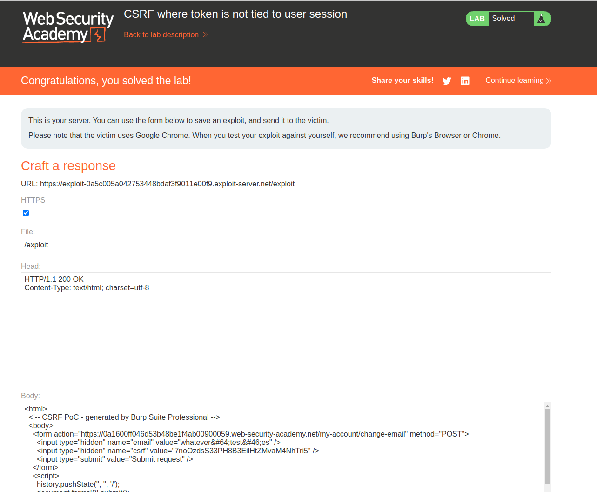

Steps to get CSRF in this lab:
1. Log in from our account.
2. Extract the CSRF token from **our session. This token will be valid for the session of the other users. That is the vulnerability.**
3. Create the CSRF PoC and attach this CSRF token to the user's session.
4. Profit.

In our account, we make a **change email request and intercept it. We copy this CSRF token and drop the request, as they are one-time use**:

7noOzdsS33PH8B3EilHtZMvaM4NhTri5

Now, create the PoC for this request in the exploit server. As the CSRF token is not tied to the user's session and has not been already used, we can create the PoC and it works:

