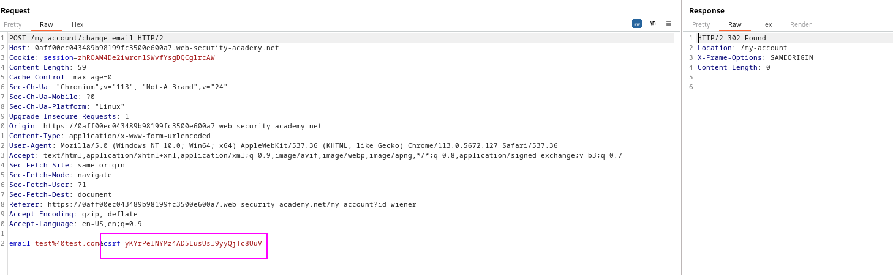
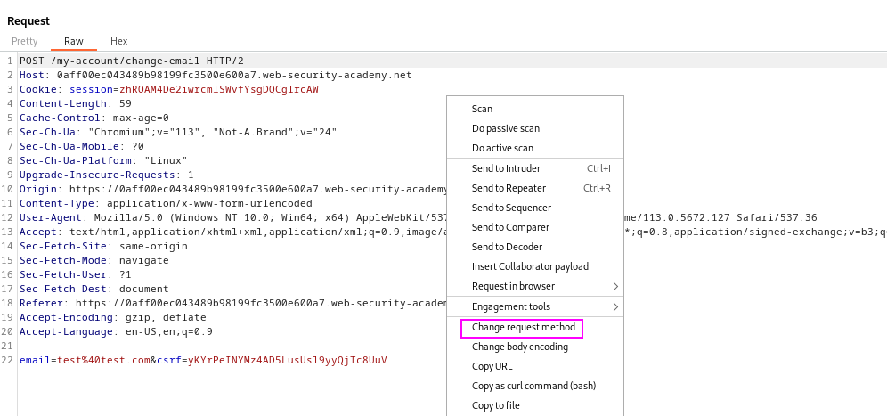
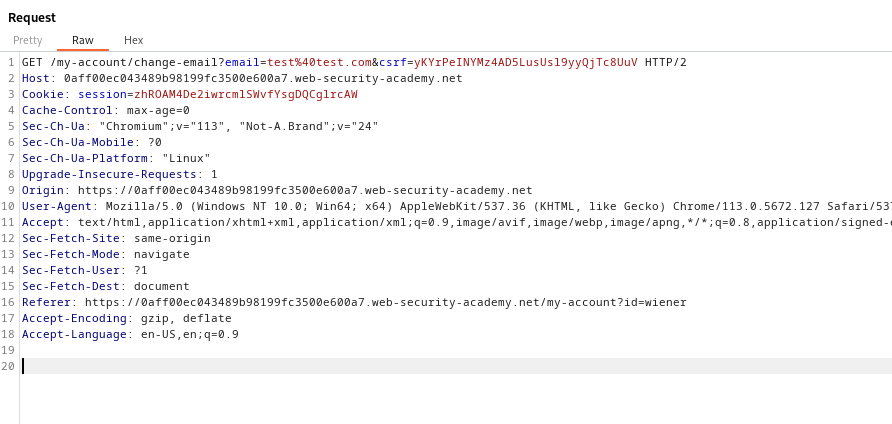
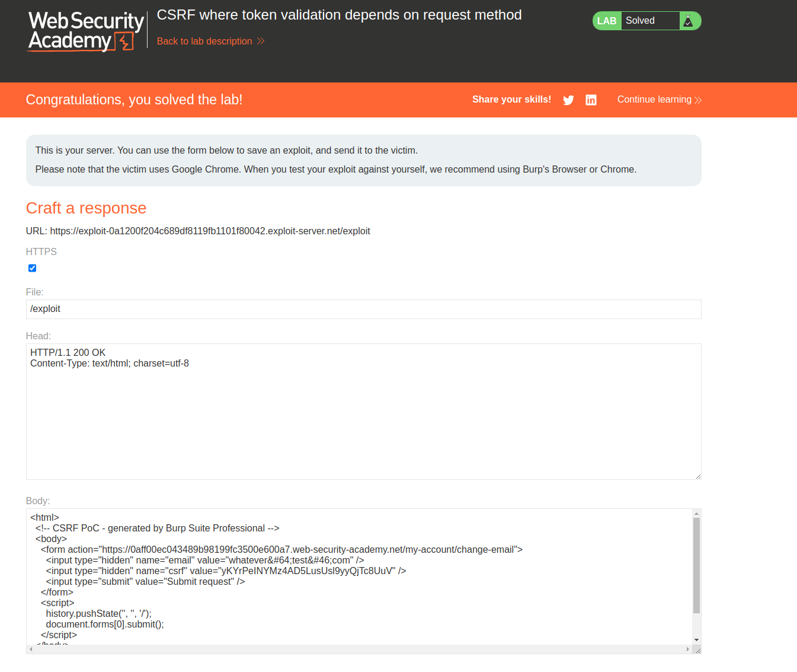

The token validation is performed in the POST method, but not in the GET method.
Let's see the POST request; we can see that there is a CSRF token:

To change the method to GET, just right click on the request and click on "Change request method":

The method has been changed to GET:

Now, let's generate the CSRF PoC and paste it into the exploit server:

