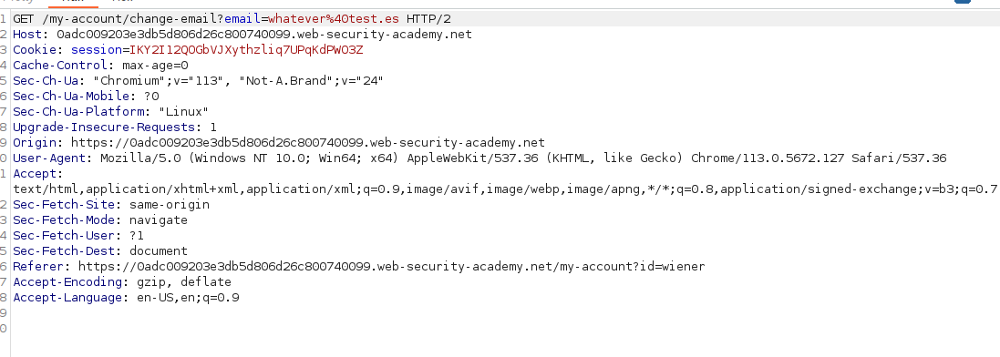
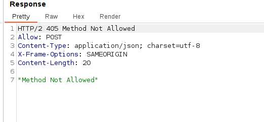
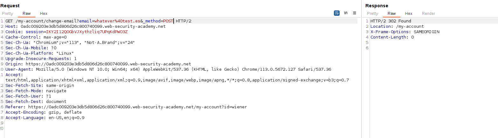
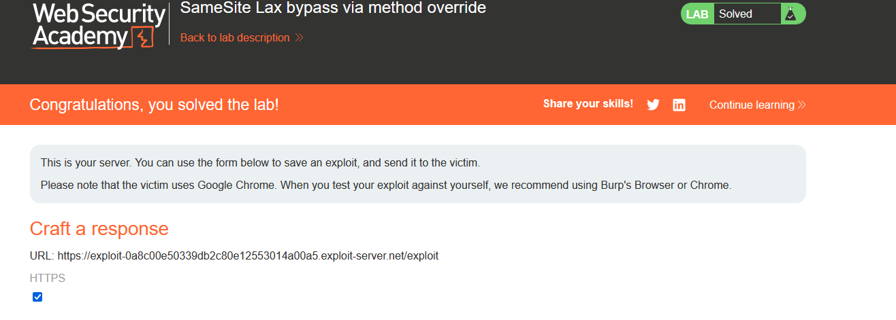

Bypassing CSRF `Samesite=Lax` options by adding a GET method so the cookie gets included in the request.

We first pass the POST request to BurpSuite's repeater so it gets converted in GET request:

Passing this request directly shows that the GET method is not allowed:

But looking the steps, it is said to add the `_method=POST` parameter to the request, this way the request is a GET request but overriding the method to POST once the request is sent:

We can see that it works. Let's send the CSRF PoC:

