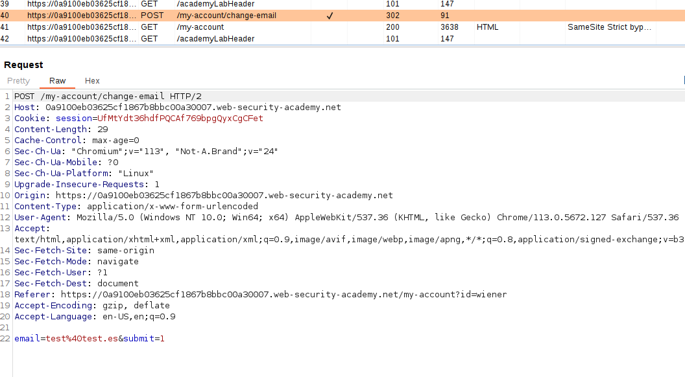
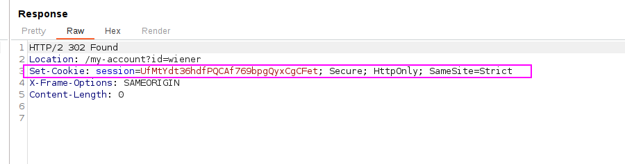
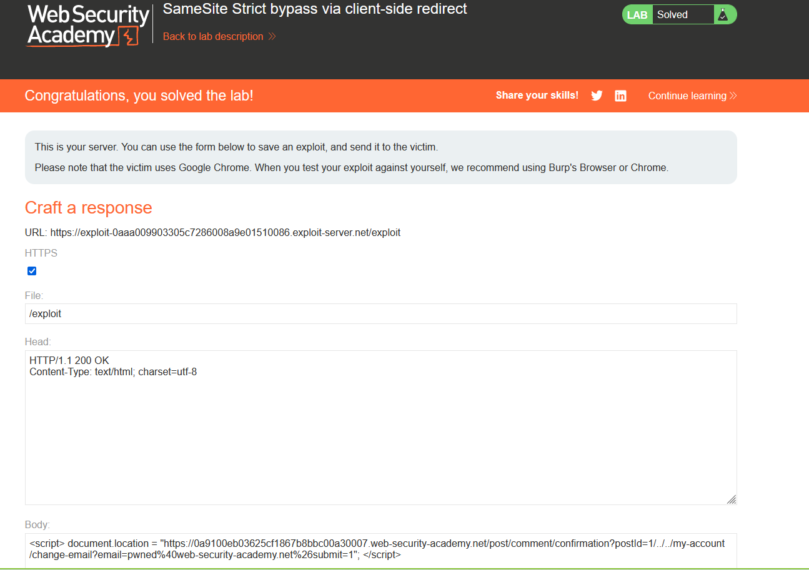

Bypassing CSRF `SameSite=Strict` cookies via a client-side redirect.

We can see that there is no CSRF token in the "change email" functionality:

But this is because, at login, the session cookies are `SameSite`, so we can't perform a CSRF:

To do this lab, I have literally followed the steps:
##### Identify a suitable gadget

1. In the browser, go to one of the blog posts and post an arbitrary comment. Observe that you're initially sent to a confirmation page at `/post/comment/confirmation?postId=x` but, after a few seconds, you're taken back to the blog post.
2. In Burp, go to the proxy history and notice that this redirect is handled client-side using the imported JavaScript file `/resources/js/commentConfirmationRedirect.js`.
3. Study the JavaScript and notice that this uses the `postId` query parameter to dynamically construct the path for the client-side redirect.
4. In the proxy history, right-click on the `GET /post/comment/confirmation?postId=x` request and select **Copy URL**.
5. In the browser, visit this URL, but change the `postId` parameter to an arbitrary string.
    `/post/comment/confirmation?postId=foo`
6. Observe that you initially see the post confirmation page before the client-side JavaScript attempts to redirect you to a path containing your injected string, for example, `/post/foo`.
7. Try injecting a [path traversal](https://portswigger.net/web-security/file-path-traversal) sequence so that the dynamically constructed redirect URL will point to your account page:
    `/post/comment/confirmation?postId=1/../../my-account`
8. Observe that the browser normalizes this URL and successfully takes you to your account page. This confirms that you can use the `postId` parameter to elicit a `GET` request for an arbitrary endpoint on the target site.

##### Bypass the SameSite restrictions
1. In the browser, go to the exploit server and create a script that induces the viewer's browser to send the `GET` request you just tested. The following is one possible approach:
    ``
2. Store and view the exploit yourself.
3. Observe that when the client-side redirect takes place, you still end up on your logged-in account page. This confirms that the browser included your authenticated session cookie in the second request, even though the initial comment-submission request was initiated from an arbitrary external site.
##### Craft an exploit
1. Send the `POST /my-account/change-email` request to Burp Repeater.
2. In Burp Repeater, right-click on the request and select **Change request method**. Burp automatically generates an equivalent `GET` request.
3. Send the request. Observe that the endpoint allows you to change your email address using a `GET` request.
4. Go back to the exploit server and change the `postId` parameter in your exploit so that the redirect causes the browser to send the equivalent `GET` request for changing your email address:
    ``
    Note that you need to include the `submit` parameter and URL encode the ampersand delimiter to avoid breaking out of the `postId` parameter in the initial setup request.
    
5. Test the exploit on yourself and confirm that you have successfully changed your email address.
6. Change the email address in your exploit so that it doesn't match your own.
7. Deliver the exploit to the victim. After a few seconds, the lab is solved.
