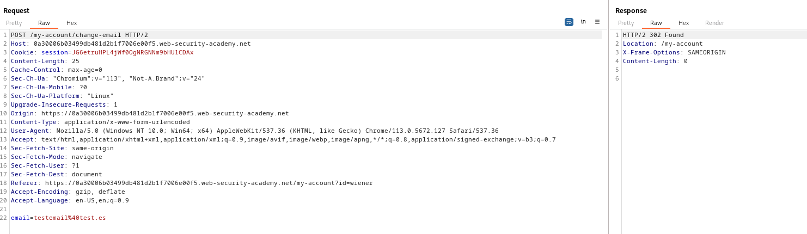
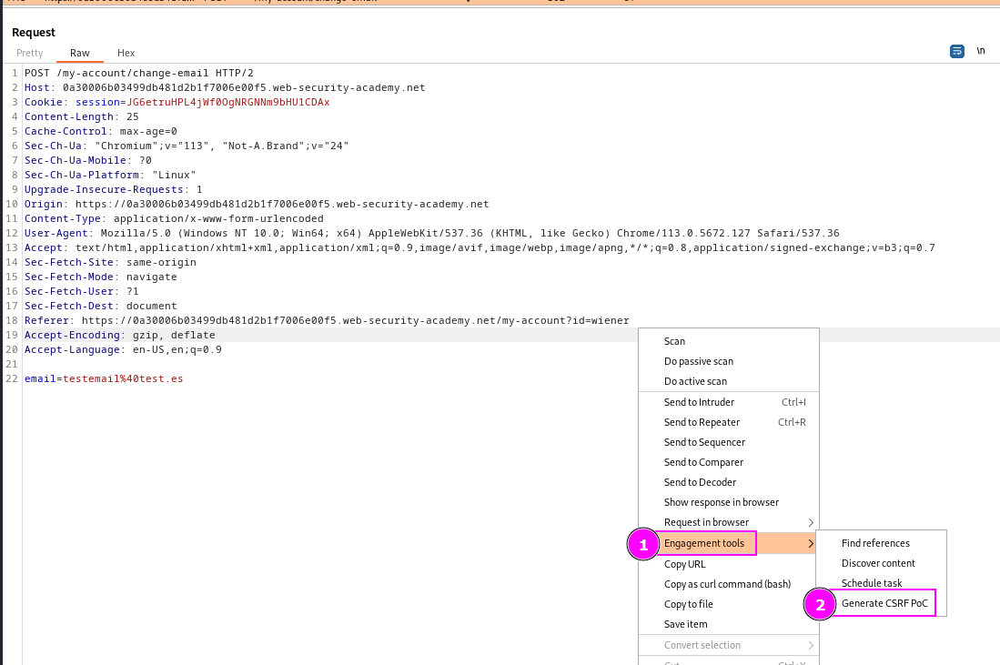
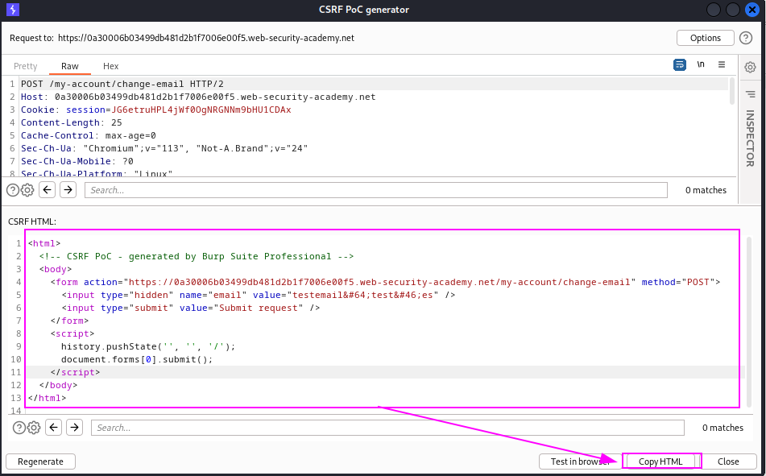
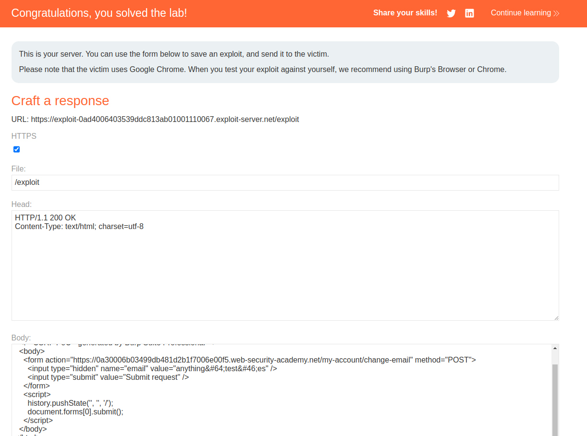

The first lab is to test how to use the CSRF PoC generator build into Burp Suite professional.

This is the request to change e-mail:

We have to play around this in the PoC generator.
Rightclicking and clicking on "Engagement tools > Generate CSRF PoC:"

We copy the generated HTML:

And paste it into the exploit server:

