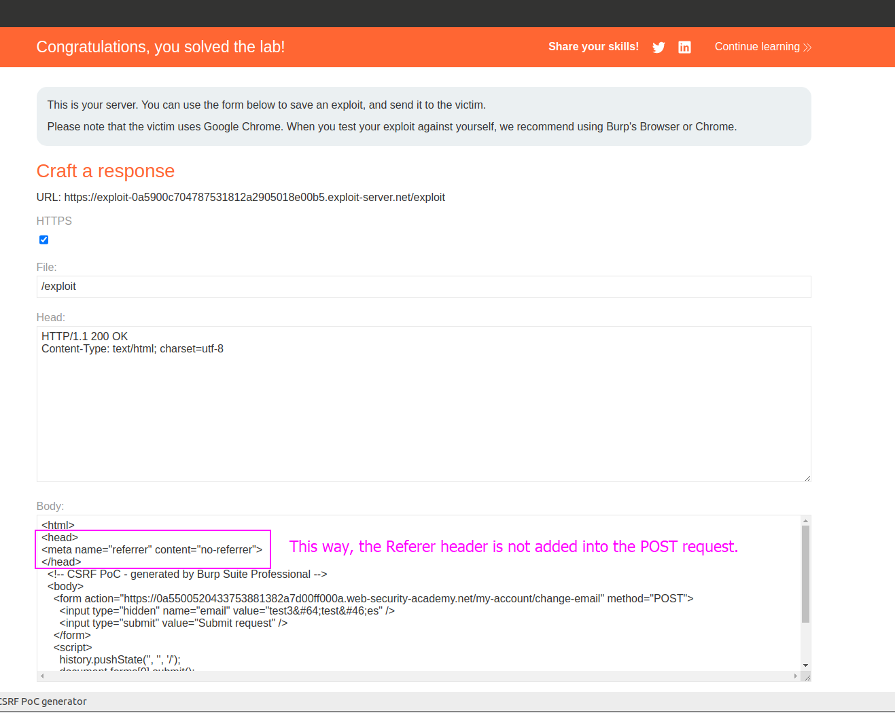

The lab is simple: The server is verifying the `Referer` header, but we will delete it in our CSRF PoC:

By adding that `head`, we make our request to not add this header and we get to bypass the verification made with this header as a request without header is working.