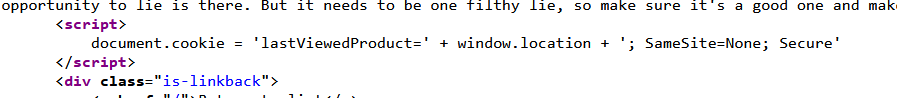

Objective of the lab: 
This lab demonstrates DOM-based client-side cookie manipulation. To solve this lab, inject a cookie that will cause [XSS](https://portswigger.net/web-security/cross-site-scripting) on a different page and call the `print()` function. You will need to use the exploit server to direct the victim to the correct pages.

How to solve it:
1. Notice that the home page uses a client-side cookie called `lastViewedProduct`, whose value is the URL of the last product page that the user visited.

1. Go to the exploit server and add the following `iframe` to the body, remembering to replace `YOUR-LAB-ID` with your lab ID:
    
    `<iframe src="https://YOUR-LAB-ID.web-security-academy.net/product?productId=1&'>" onload="if(!window.x)this.src='https://YOUR-LAB-ID.web-security-academy.net';window.x=1;">`
3. Store the exploit and deliver it to the victim.

The original source of the `iframe` matches the URL of one of the product pages, except there is a JavaScript payload added to the end. When the `iframe` loads for the first time, the browser temporarily opens the malicious URL, which is then saved as the value of the `lastViewedProduct` cookie. The `onload` event handler ensures that the victim is then immediately redirected to the home page, unaware that this manipulation ever took place. While the victim's browser has the poisoned cookie saved, loading the home page will cause the payload to execute.